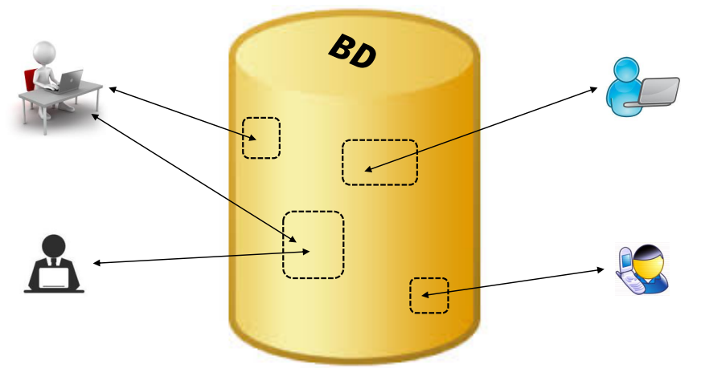
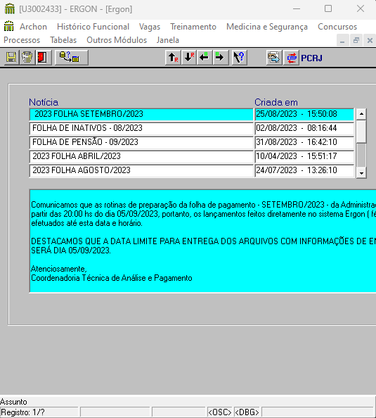
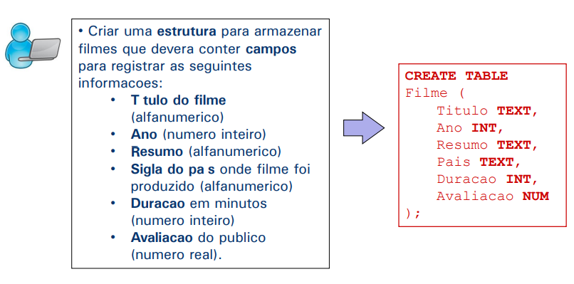
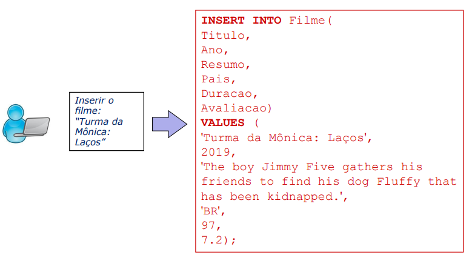
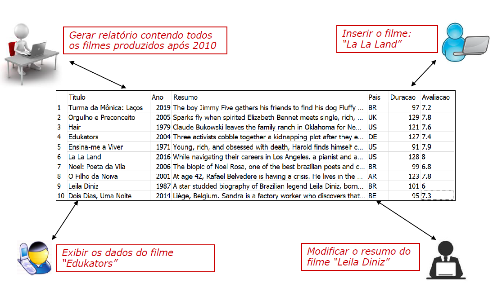

class: center, middle
```{r xaringan-themer, include=FALSE, warning=FALSE}
library(xaringanthemer)
style_mono_accent(
  base_color = "#004b80",
  header_font_google = google_font("Josefin Sans"),
  text_font_google   = google_font("Montserrat", "300", "300i"),
  code_font_google   = google_font("Fira Mono")
)
```

```{r xaringan-logo, echo=FALSE}
xaringanExtra::use_logo(
  image_url = "logo.png",
  position = xaringanExtra::css_position(top = "1em", right = "1em"),
  width = "200px"
)

```

# Introdução

---
class: inverse, center, middle

# O que é um banco de dados?

---

# Introdução

### O que é um banco de dados?

De maneira simplificada podemos definir **banco de dados (BD)** como um <span style="color:red;">*repositório central*</span> de informações que podem ser consultadas e/ou atualizadas por <span style="color:red;">*diversos usuários*</span> simultaneamente.

```{r echo=FALSE, out.width="70%", fig.align='center', dpi=300}

```
---

### Introdução

- Interagimos diariamente com bancos de dados de maneira direta ou indireta.

--

- Conversas ao celular, transações bancarias e consultas ao **ERGON** são exemplos de operações que produzem registros em bancos de dados.

--

- Sempre que visitamos algum site (Google, globo.com, processo.rio, ...) existe um BD **"por trás da cena"** para retornar a informação requisitada. 

--

- A grande maioria dos sistemas que usamos tem como peça fundamental um ou mais bancos de dados. 

---

### Principais características dos BDs

--

- São projetados, construídos e populados com um propósito específico. Os dados contidos em um BD representam algum aspecto do mundo real, denominado <span style="color:red;">**minimundo**</span>. Qualquer mudança no minimundo deve ser refletida no BD.

--

- Armazena conteúdo de interesse para <span style="color:red;">**muitos usuários**</span>.

--

- Seus dados são enxergados e manipulados de maneira unificada, podendo ser acessados a partir de um <span style="color:red;">**repositório central**</span>.

--

- Ao invés de estarem estruturados em planilhas ou arquivos CSV, os dados do BD são estruturados em um software denominado <span style="color:red;">**Sistema Gerenciador de Banco de Dados (SGBD)**</span>. 
---

### Principais características dos BDs
.pull-left[
- **Exemplo:** <strong style="color:red;">*ERGON*</strong>

- **Minimundo:** sistema de gestão de pessoas para setor público que gera automaticamente a folha de pagamento, incluindo os eventos retroativos e a contagem de tempo

- **Usuários:** Funcionários da Prefeitura

- **Repositório Central:** ERGON

- **SGBD:** ORACLE
]
.pull-right[
```{r echo=FALSE, out.width="100%", fig.align='left', dpi=300}

```
]
---
### Principais características dos BDs

- Bancos de dados podem ser de **qualquer tamanho** ou **complexidade**. Atualmente, os bancos de dados de empresas rotineiramente armazenam **terabytes** ( $10^{12}$ bytes) ou **pentabytes** ( $10^{15}$ bytes) de dados, que são servidos aos seus usuários.

- Cadastros no ERGON: 
  + $336.953$ funcionários;
  + $574.299$ vínculos;
  + $1.020$ tipos de vantagem;
  + $1,4*10^{9}$ registros na tabela <strong style="color:red;">FICHAS_FINANCEIRAS</strong>.
  
---
### Sistema Gerenciador de Banco <br>de Dados

- Software especial e muito sofisticado que permite a definição, construção, manipulação e compartilhamento de bancos de dados entre vários usuários e aplicações. 
- Ele é também utilizado para garantir a segurança dos dados, protegendo-os contra falhas (ex: falhas de hardware) ou tentativas de acesso não autorizado.
- Alguns exemplos de SGBD’s famosos: 

```{r echo=FALSE, out.width="150%", fig.align='center', dpi=300}

```

---
### Tipos de usuários de um SGBD
- **DBA** (*database administrator*): responsável pela instalação, autorização do acesso, monitoramento do uso e da administração geral do SBGD.

- **Projetista**: responsável pelo projeto e criação do banco de dados de um determinado sistema da empresa. Para tal, ele
precisa receber autorização do DBA.

- **Usuário Final**: usuários que consultam ou atualizam o banco de dados, através de algum sistema.

--

- **Cientista de dados**: usuário interessado em consultar, coletar, explorar e analisar os dados armazenados em um SGBD, 
normalmente utilizando uma linguagem de consulta como a SQL.

---
### Funcionalidades de um SGBD
1. Permitir com que usuários **definam** e **construam** BDs, especificando suas *estruturas de armazenamento* (esquemas) com o uso de uma linguagem de definição de dados.

```{r echo=FALSE, out.width="100%", fig.align='center', dpi=300}

```

---
### Funcionalidades de um SGBD
<ol start="2">

<li> Dar aos usuários a habilidade de consultar (querying) os dados e modifica-los, com o uso de uma linguagem de manipulação de dados.

</ol>

```{r echo=FALSE, out.width="100%", fig.align='center', dpi=300}

```

---
### Funcionalidades de um SGBD
<ol start="3">
<li> Suportar o armazenamento de <strong style="color:red;">grandes quantidades de dados</strong>, permitindo o acesso <strong>eficiente</strong> às informações por múltiplos usuários, de forma concorrente.
</ol>

```{r echo=FALSE, out.width="100%", fig.align='center', dpi=300}

```

---
### Funcionalidades de um SGBD
<ol start="4">
<li> Oferecer um sistema de <strong style="color:red;">backup</strong> que permita a recuperação de dados que sejam corrompidos (por motivo de falha de hardware ou software) ou perdidos de forma acidental. </br>
<li> Oferecer mecanismos para <strong style="color:red;">controle de acesso</strong> não autorizado.
<ul> 
<li> Quando múltiplos usuários compartilham o acesso a um banco de dados, é comum que muitos deles não estejam autorizados a acessar todas as informações contidas no banco.
<li> Através do sistema de segurança e controle de acesso do SGBD, o DBA pode especificar as restrições de acesso associadas a cada perfil/conta de usuário.
</ul>
<li> Garantir que as  <strong style="color:red;">restrições de integridade</strong> associadas aos dados (definidas pelo Projetista do Banco) sejam sempre respeitadas, para que o banco mantenha se sempre em um estado consistente.
<ul>
<li> <strong>Ex.:</strong> Não permitir que um mesmo funcionário seja cadastrado duas vezes;
<li> Não permitir que um texto seja gravado no campo referente à data de nascimento; 
</ul>
</ol>

---
### Ferramentas
Durante o curso, usaremos algumas ferramentas na interação com bancos de dados.

<ol>
<li> <strong>Editores de texto:</strong> Ferramentas de software projetadas para <strong style="color:red;">criar</strong>, <strong style="color:red;">modificar</strong>, <strong style="color:red;">formatar</strong> e <strong style="color:red;">armazenar</strong> documentos de texto. Eles têm uma variedade de usos e são amplamente utilizados na programação e desenvolvimento de software.  <strong>Ex.: NOTEPAD++</strong> 
</br>
<li> <strong>Interface de Linha de Comando (CLI):</strong> Usados para executar tarefas em aplicações diversas. Geralmente, possuem um formato simples, exibindo apenas os comandos seus e resultados. <strong>Ex.: SQL*Plus</strong> 
<li> <strong>Oracle forms:</strong> Software usado para criar interfaces para interação com bancos de dados Oracle. Permite ao usuário final carregar, alterar e visualizar dados sem precisar escrever comandos SQL. <strong>Ex.: ERGON</strong> 
</ol>

---
class: inverse, center, middle

# Teoria de conjuntos

---
### Teoria de conjuntos


```{r conjuntos, echo=FALSE, message=F, warning=F,out.width="80%", fig.align='center', dpi=600}
library(ggplot2)
library(patchwork)
library(ggforce)
library(dplyr)
library(latex2exp)

y=seq(-.75,.75, by=.001) 
x=sqrt(.75^2-y^2)
x2=x+1
y2=y+1
x3=-x+2
df=data.frame(x2,y2) |> 
    filter(y2<1+sqrt(.75^2-.5^2) & y2 > 1-sqrt(.75^2-.5^2)) |> 
    rbind(data.frame(x2=x3,y2=y2) |> 
    filter(y2<1+sqrt(.75^2-.5^2) & y2 > 1-sqrt(.75^2-.5^2)))


p1 <- ggplot() +
      geom_circle(aes(x0 = c(1),y0 = c(1), r = rep(.75,1)), size = 2, fill = "darkgreen") +
      geom_circle(aes(x0 = c(1,2),y0 = c(1,1), r = rep(.75,2)), size = 2, n = 1000) +
      geom_text(aes(x = c(.5,2.5), y = rep(.15,2), label = c("A","B")), size = 6) +
      geom_text(aes(x = 0.25, y = 2, label = "U"), size = 6) +
      annotate("text",x = 1.5, y = 2, label = TeX("$A$",bold = T, output="character"),
               size = 8, parse=TRUE, color = "darkred") +
      coord_equal(xlim = c(0,3), ylim = c(0,2.25)) +
      theme_void() + 
      theme(panel.border = element_rect(colour = "black", fill = NA, linewidth = 2),
            panel.background = element_rect(fill = "#fff2d7", size = 0.5, linetype = "solid"),
            plot.margin = unit(c(.25,.25,.25,.25), "cm"))

p2 <- ggplot() +
      geom_circle(aes(x0 = c(1),y0 = c(1), r = rep(.75,1)), size = 2, fill = "#fff2d7") +
      geom_circle(aes(x0 = c(1,2),y0 = c(1,1), r = rep(.75,2)), size = 2, n = 1000) +
      geom_text(aes(x = c(.5,2.5), y = rep(.15,2), label = c("A","B")), size = 6) +
      geom_text(aes(x = 0.25, y = 2, label = "U"), size = 6) +
      annotate("text",x = 1.5, y = 2, label = TeX("$A'$",bold = T, output="character"),
               size = 8, parse=TRUE, color = "darkred") +
      coord_equal(xlim = c(0,3), ylim = c(0,2.25)) +
      theme_void() + 
      theme(panel.border = element_rect(colour = "black", fill = NA, linewidth = 2),
            panel.background = element_rect(fill = "darkgreen", size = 0.5, linetype = "solid"),
            plot.margin = unit(c(.25,.25,.25,.25), "cm"))

p3 <- ggplot() +
      geom_circle(aes(x0 = c(1,2),y0 = c(1,1), r = rep(.75,2)), size = 2, fill = "darkgreen") +
      geom_circle(aes(x0 = c(1,2),y0 = c(1,1), r = rep(.75,2)), size = 2, n = 1000) +
      geom_text(aes(x = c(.5,2.5), y = rep(.15,2), label = c("A","B")), size = 6) +
      geom_text(aes(x = 0.25, y = 2, label = "U"), size = 6) +
      annotate("text",x = 1.5, y = 2, label = TeX("$A\\cup B$",bold = T, output="character"),
               size = 8, parse=TRUE, color = "darkred") +
      coord_equal(xlim = c(0,3), ylim = c(0,2.25)) +
      theme_void() + 
      theme(panel.border = element_rect(colour = "black", fill = NA, linewidth = 2),
            panel.background = element_rect(fill = "#fff2d7", size = 0.5, linetype = "solid"),
            plot.margin = unit(c(.25,.25,.25,.25), "cm"))

p4 <- ggplot() +
      geom_polygon(data = df, aes(x=x2,y=y2), fill = "darkgreen") +
      geom_circle(aes(x0 = c(1,2),y0 = c(1,1), r = rep(.75,2)), size = 2, n = 1000) +
      # geom_point(aes(x= 1.5,  y = 1+sqrt(.75^2-.5^2)), color ="red") +
      geom_text(aes(x = c(.5,2.5), y = rep(.15,2), label = c("A","B")), size = 6) +
      # geom_text(aes(x = 0.25, y = 2, label = "u"), size = 10) +
      geom_text(aes(x = 0.25, y = 2, label = "U"), size = 6) +
      annotate("text",x = 1.5, y = 2, label = TeX("$A\\cap B$",bold = T, output="character"), 
               size = 8, parse=TRUE, color = "darkred") +
      coord_equal(xlim = c(0,3), ylim = c(0,2.25)) +
      theme_void() + 
      theme(panel.border = element_rect(colour = "black", fill = NA, linewidth = 2),
            panel.background = element_rect(fill = "#fff2d7", size = 0.5, linetype = "solid"),
            plot.margin = unit(c(.25,.25,.25,.25), "cm"))

p4 <- ggplot() +
      geom_polygon(data = df, aes(x=x2,y=y2), fill = "darkgreen") +
      geom_circle(aes(x0 = c(1,2),y0 = c(1,1), r = rep(.75,2)), size = 2, n = 1000) +
      # geom_point(aes(x= 1.5,  y = 1+sqrt(.75^2-.5^2)), color ="red") +
      geom_text(aes(x = c(.5,2.5), y = rep(.15,2), label = c("A","B")), size = 6) +
      # geom_text(aes(x = 0.25, y = 2, label = "u"), size = 10) +
      geom_text(aes(x = 0.25, y = 2, label = "U"), size = 6) +
      annotate("text",x = 1.5, y = 2, label = TeX("$A\\cap B$",bold = T, output="character"), 
               size = 8, parse=TRUE, color = "darkred") +
      coord_equal(xlim = c(0,3), ylim = c(0,2.25)) +
      theme_void() + 
      theme(panel.border = element_rect(colour = "black", fill = NA, linewidth = 2),
            panel.background = element_rect(fill = "#fff2d7", size = 0.5, linetype = "solid"),
            plot.margin = unit(c(.25,.25,.25,.25), "cm"))

p5 <- ggplot() +
      geom_circle(aes(x0 = c(1),y0 = c(1), r = rep(.75,1)), size = 2, fill = "darkgreen") +
      geom_circle(aes(x0 = c(2),y0 = c(1), r = rep(.75,1)), size = 2, fill = "#fff2d7") +
      geom_circle(aes(x0 = c(1,2),y0 = c(1,1), r = rep(.75,2)), size = 2, n = 1000) +
      geom_text(aes(x = c(.5,2.5), y = rep(.15,2), label = c("A","B")), size = 6) +
      geom_text(aes(x = 0.25, y = 2, label = "U"), size = 6) +
      annotate("text",x = 1.5, y = 2, label = TeX("$A - B$",bold = T, output="character"),
               size = 8, parse=TRUE, color = "darkred") +
      coord_equal(xlim = c(0,3), ylim = c(0,2.25)) +
      theme_void() + 
      theme(panel.border = element_rect(colour = "black", fill = NA, linewidth = 2),
            panel.background = element_rect(fill = "#fff2d7", size = 0.5, linetype = "solid"),
            plot.margin = unit(c(.25,.25,.25,.25), "cm"))

p6 <- ggplot() +
      geom_circle(aes(x0 = c(1,2),y0 = c(1,1), r = rep(.75,2)), size = 2, fill = "darkgreen") +
      geom_polygon(data = df, aes(x=x2,y=y2), fill = "#fff2d7") +
      geom_circle(aes(x0 = c(1,2),y0 = c(1,1), r = rep(.75,2)), size = 2, n = 1000) +
      geom_text(aes(x = c(.5,2.5), y = rep(.15,2), label = c("A","B")), size = 6) +
      geom_text(aes(x = 0.25, y = 2, label = "U"), size = 6) +
      annotate("text",x = 1.5, y = 2, label = TeX("$A\\cup B - A\\cap B$",bold = T, output="character"),
               size = 4, parse=TRUE, color = "darkred") +
      coord_equal(xlim = c(0,3), ylim = c(0,2.25)) +
      theme_void() + 
      theme(panel.border = element_rect(colour = "black", fill = NA, linewidth = 2),
            panel.background = element_rect(fill = "#fff2d7", size = 0.5, linetype = "solid"),
            plot.margin = unit(c(.25,.25,.25,.25), "cm"))


p1+p2+p3+p4+p5+p6
```
