class: center, middle
```{r xaringan-themer, include=FALSE, warning=FALSE}
library(xaringanthemer)
style_mono_accent(
  base_color = "#004b80", 
  header_font_google = google_font("Josefin Sans"),
  text_font_google   = google_font("Montserrat", "300", "300i"),
  code_font_google   = google_font("Fira Mono"),
)
```

```{r xaringan-logo, echo=FALSE}
xaringanExtra::use_logo(
  image_url = "logo.png",
  position = xaringanExtra::css_position(top = "1em", right = "1em"),
  width = "200px"
)

```

# SQL

---
class: inverse, center, middle

# Structured Query Language

<p1 style='color:gray;font-size:24px'><i> linguagem de consultas estruturadas </i></p1>

---
### SQL

Sistemas gerenciadores de bancos de dados são manipulados através de uma linguagem padrão, desenvolvida especificamente para o ambiente relacional, denominada **SQL**. 
A linguagem SQL é composta por um reduzido conjunto de **instruções** que permitem manipular um banco de dados com diferentes finalidades.

```{r tabela, echo=F}
tibble::tibble(
  FINALIDADE = c("Recuperar dados",
                 "Manipular dados",
                 "Definir dados",
                 "Controlar transações"), 
  INSTRUÇÕES = c("SELECT",
                 "INSERT, UPDATE e DELETE",
                 "CREATE, ALTER e DROP",
                 "COMMIT e ROLLBACK"),
  DESCRIÇÃO = c("Recupera registros armazenados em tabelas do banco de dados",
                "Inserção, alteração e remoção de registros de tabelas do banco de dados. Este subconjunto de instruções da SQL é                  conhecido como DML (Data Manipulation Language)",
                "Criação, alteração e exclusão de objetos do banco de dados (ex.: tabelas, índices, etc.). Este subconjunto de                     instruções é conhecido como DDL (Data Definition Language).",
                "Gerenciam as modificações realizadas pelos comandos DML. Permitem agrupar as alterações dos dados em transações                   lógicas.")
) |> 
  gt::gt() |> 
  gt::tab_style(style = gt::cell_text(weight = "bold",size = 18), 
                locations = gt::cells_column_labels()) |> 
  gt::tab_style(style = gt::cell_text(weight = "bold",size = 22), 
                locations = gt::cells_body()) |> 
  gt::opt_stylize(style = 5, color = "blue", add_row_striping = F)

```

---
class: inverse, center, middle

# SELECT

---
### SELECT
No trabalho com bancos de dados e SQL, a tarefa mais comum é recuperar dados de uma ou mais tabelas. A instrução **SELECT**  nos permite realizar consultas sobre todos os registros armazenados em nossos bancos de dados. Usaremos as tabelas do <strong style="color:red;">ERGON</strong> em todos os exemplos.

--
</br> </br>
Inicialmente, vamos trabalhar com a tabela <strong style="color:red;">FICHAS_FINANCEIRAS</strong>, que armazena os registros de vantagens e descontos da folha de pagamento. 


```{r tabela2, echo=F, warning=F}
tibble::tibble(
  ATRIBUTO = c(
    "NUMFUNC",
    "NUMVINC",
    "NUMPENS",
    "EMP_CODIGO",
    "MES_ANO_FOLHA",
    "MES_ANO_DIREITO",
    "NUM_FOLHA",
    "RUBRICA",
    "TIPO_RUBRICA",
    "VALOR",
    "LANCAMENTO",
    "EXECUCAO",
    "CORRECAO",
    "COMPLEMENTO",
    "DESC_VANT"
    ), 
  TIPO = c(
    "NUMBER(9)",
    "NUMBER(8)",
    "NUMBER(2)", 
    "NUMBER(2)",
    "DATE",
    "DATE",
    "NUMBER(8)",
    "NUMBER(8)",
    "NUMBER(1)",
    "NUMBER(11,2)",
    "NUMBER(14)",
    "NUMBER(5)",
    "NUMBER(11,2)",
    "VARCHAR2(20)",
    "VARCHAR2(1)"
           ),
  PK = c(
    NULL
  ),
  `PODE SER NULL*` = c(
    "NÃO",
    "NÃO",
    "SIM",
    "NÃO",
    "NÃO",
    "NÃO",
    "NÃO",
    "NÃO",
    "NÃO",
    "NÃO",
    "NÃO",
    "SIM",
    "SIM",
    "SIM",
    "NÃO"
    ),
  FK = c(
    NULL
  ),
  DESCRIÇÃO = c(
    "Código de identificação do funcionário",
    "Código de identificação do vínculo",
    "Código de identificação do pensionista",
    "Código de identificação da empresa",
    "Mês/Ano da folha de pagamento",
    "Mês/Ano do direito (competência)",
    "Número da folha de pagamento",
    "Código da rubrica associada ao pagamento",
    "Tipo da rubrica (1 = Mesmo mês da competência; 2 = Mês diferente da competência)",
    "Valor do pagamento",
    "Código do lançamento",
    "Número da execução da folha",
    "Correção monetária",
    "Informação adicional associada à rubrica",
    "Tipo da rubrica (1 = Vantagem; 2 = Desconto)"
  )
) |> 
  gt::gt() |> 
  # gt::data_color(columns = TIPO, apply_to = "text",colors =  c("darkgreen","darkblue","black")) |> 
  gt::data_color(columns = `PODE SER NULL*`, apply_to = "text",colors =  c("black","orangered3")) |> 
  gt::tab_options(table.font.size = 15,
                  container.width = 900,
                  container.height = 250) |> 
  gt::tab_style(style = gt::cell_text(weight = "bold",size = 18), 
                locations = gt::cells_column_labels()) |> 
  gt::tab_style(style = gt::cell_text(weight = "bold",size = 22), 
                locations = gt::cells_body()) |> 
  gt::opt_stylize(style = 5, color = "blue", add_row_striping = F)

```

.footnote[\* **NULL** é uma palavra que atribui um valor nulo para um campo, célula ou código em um banco de dados.]
---
### SELECT
**Exemplo 1:** Selecionando **todos** os registros de uma tabela.  
```{sql eval = F}
SELECT * 
FROM ERGON.FICHAS_FINANCEIRAS;
```

.pull-left[
Para exibir todas as colunas de uma tabela, deve-se utilizar a palavra-chave **SELECT** seguida de um __*__ (asterisco). A tabela a ser consultada deve ser indicada após a palavra-chave **FROM**. 
</br>
No exemplo, selecionamos todos os registros da tabela <strong style="color:red;">FICHAS_FINANCEIRAS</strong>.
]
.pull-right[
```{r echo=FALSE, out.width="100%", fig.align='center', dpi=600}
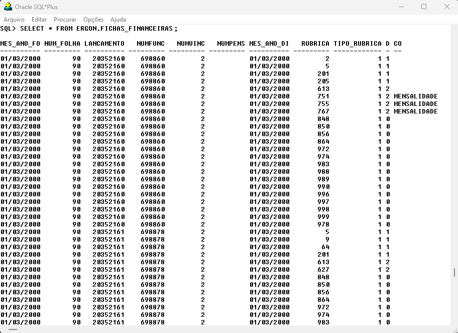
```
]

---
### SELECT
**Exemplo 2:** Selecionando **colunas específicas** de uma tabela.
```{sql eval = F}
SELECT MES_ANO_FOLHA, NUM_FOLHA, LANCAMENTO 
FROM ERGON.FICHAS_FINANCEIRAS;
```

.pull-left[
Para selecionar colunas específicas de uma tabela, a lista de nomes das colunas deve ser especificada logo após a palavra-chave **SELECT**. Os nomes das colunas devem ser separados por vírgulas.
</br>
No exemplo, selecionamos as colunas **MES_ANO_FOLHA**, **NUM_FOLHA** e **LANCAMENTO** da tabela <strong style="color:red;">FICHAS_FINANCEIRAS</strong>.
]
.pull-right[
```{r echo=FALSE, out.width="100%", fig.align='center', dpi=600}
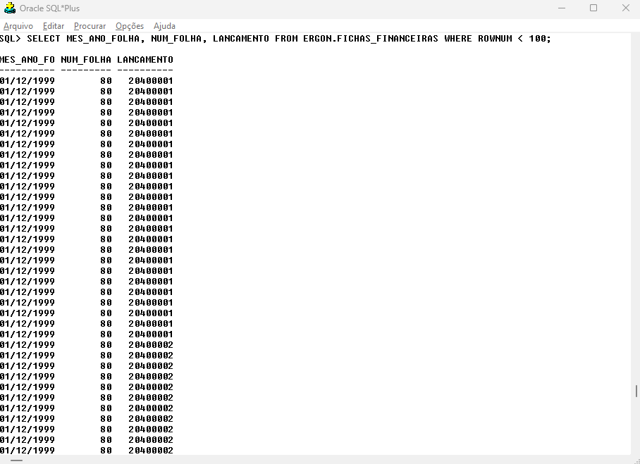
```
]

---
### SELECT 

#### **Definição 1**: Sintaxe da instrução **SELECT** básica
Uma instrução **SELECT** básica deve ser composta por ao menos duas cláusulas (partes):
1. Uma cláusula **SELECT** que especifica a coluna a ser exibida (ou lista de colunas);
2. Uma cláusula **FROM** que especifica a tabela que contém as colunas listadas na cláusula **SELECT**.

```{sql eval = F}
SELECT * | col 1, ..., col n 
FROM tabela;
```

As instruções SQL não fazem distinção entre letras maiúsculas e minúsculas. Muitas vezes as cláusulas são colocadas em linhas separadas (como na definição acima e nos exemplos anteriores) com a única finalidade de melhorar a legibilidade (ou seja: não
há problema em colocar a cláusula **FROM** na mesma linha da cláusula **SELECT**).

.footnote[\* Nesse contexto, a notação "**|**" significa **OU**.]

---
### SELECT
**Exemplo 3:** Selecionando valores sem linhas duplicadas usando a palavra-chave **DISTINCT**.
```{sql eval = F}
SELECT DISTINCT NUM_FOLHA 
FROM ERGON.FICHAS_FINANCEIRAS;
```

.pull-left[
Embora existam múltiplos registros na tabela <strong style="color:red;">FICHAS_FINANCEIRAS</strong> para cada **NUM_FOLHA**, a consulta retorna cada valor único apenas uma vez. O comportamento padrão do SQL é o oposto: se a palavra-chave **DISTINCT** não for usada, a consulta retornará valores repetidos **sem suprimir nenhuma linha**. 
]
.pull-right[
```{r echo=FALSE, out.width="100%", fig.align='center', dpi=600}
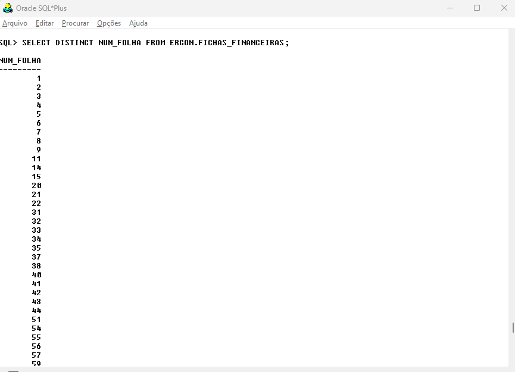
```
]

---
### SELECT
A palavra **DISTINCT** também pode ser utilizada com múltiplas colunas. Com isto, todas as combinações de valores distintas das colunas podem ser identificadas. 

```{sql eval = F}
SELECT DISTINCT NUM_FOLHA, MES_ANO_FOLHA 
FROM ERGON.FICHAS_FINANCEIRAS;
```
.pull-left[
```{r echo=FALSE, out.width="70%", fig.align='center', dpi=600, fig.cap='SELECT COM DISTINCT'}
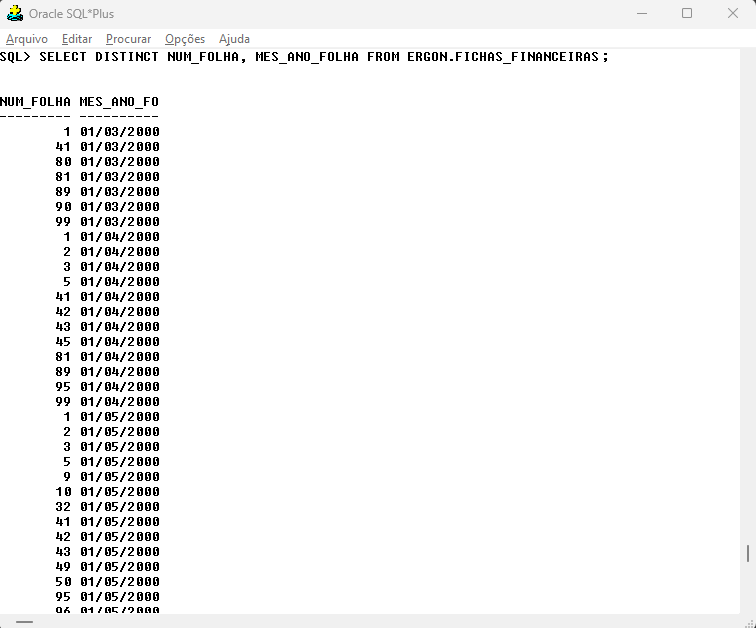
```
]
.pull-right[
```{r echo=FALSE, out.width="70%", fig.align='center', dpi=600, fig.cap='SELECT SEM DISTINCT'}
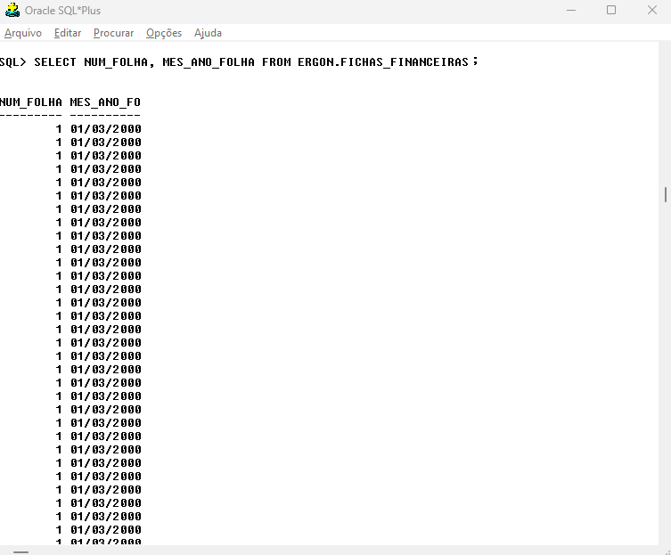
```
]
---
### SELECT 
**Exemplo 4:** Definindo rótulos (apelidos) para as colunas.
```{sql eval = F}
SELECT DISTINCT NUM_FOLHA AS FOLHA, MES_ANO_FOLHA AS MES 
FROM ERGON.FICHAS_FINANCEIRAS;
```
.pull-left[
<p style='font-size:18px;align=justify'>
Ao exibir o resultado de uma consulta, os nomes das colunas selecionadas são exibidos no cabeçalho por padrão. No entanto, podemos definir novos rótulos para as colunas na cláusula <strong>SELECT</strong>. Para isso, podemos usar o termo <strong>AS</strong> após o nome da coluna (ex.: NUM_FOLHA AS FOLHA). Na maioria dos SGBDs, o uso do termo <strong>AS</strong> é opcional e pode ser suprimido (ex.: NUM_FOLHA FOLHA). Alguns SGBDs, como o ORACLE, permitem o uso de espaços e caractéres especiais (tais como “*”, “#” ou “$”). Nesse caso, é preciso definir o nome do rótulo entre aspas duplas (ex.: NUM_FOLHA "NÚMERO DA FOLHA").
</p>
]
.pull-right[
```{r echo=FALSE, out.width="90%", fig.align='center', dpi=600}
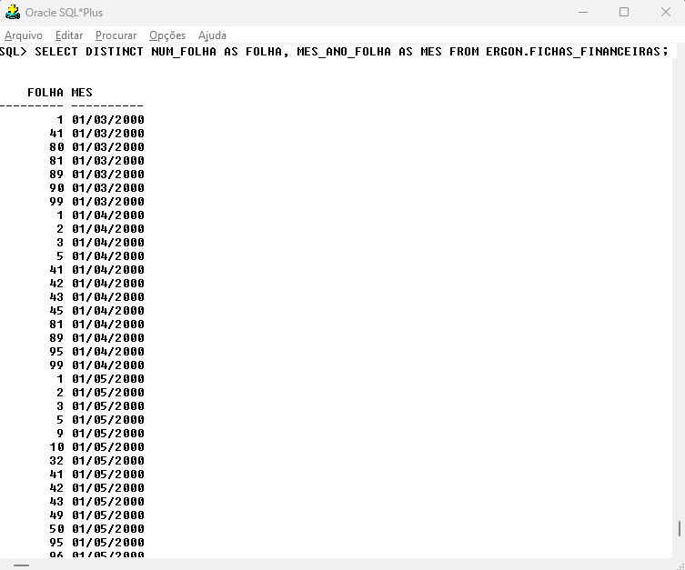
```
]
---
### SELECT 
#### **Definição 2**: Sintaxe estendida da instrução **SELECT** básica
Uma instrução **SELECT** pode **opcionalmente** conter rótulos para as colunas. Também de maneira opcional, uma instrução SQL pode fazer uso da palavra-chave **DISTINCT** para suprimir linhas repetidas. Com isto, o quadro a seguir apresenta o modelo estendido para a sintaxe de uma instrução **SELECT** (as partes opcionais são exibidas entre colchetes).   

```{sql eval = F}
SELECT [DISTINCT] * | col 1 [AS apelido 1], ..., col n [AS apelido n]
FROM tabela;
```
---
class: inverse, center, middle

# WHERE

---
class: center, middle

# Restringindo conjuntos de dados

---
### WHERE

Ao trabalhar com bases de dados, podemos estar interessados em recuperar apenas parte de uma tabela. Para isso, podemos usar uma cláusula para **limitar** quais linhas vamos selecionar. Além disso, ao lidar com grandes bases de dados, muitas vezes é inviável recuperar tabelas completas devido ao custo operacional. A instrução **WHERE** nos permite filtrar os dados usando um ou mais critérios.  

---
### WHERE
**Exemplo 5:** Selecionando todos os registros de uma tabela com uma **característica específica**.  
```{sql eval = F}
SELECT * 
FROM ERGON.FICHAS_FINANCEIRAS 
WHERE MES_ANO_FOLHA = '01/09/2023';
```

.pull-left[
No exemplo, a instrução **SELECT** recupera os registros da tabela <strong style="color:red;">FICHAS_FINANCEIRAS</strong> cujo valor da coluna **MES_ANO_FOLHA** seja igual a <strong style="color:red;">01/09/2023</strong>. Para isso, usamos a cláusula **WHERE** após a cláusula **FROM**. 
]
.pull-right[
```{r echo=FALSE, out.width="90%", fig.align='center', dpi=600}
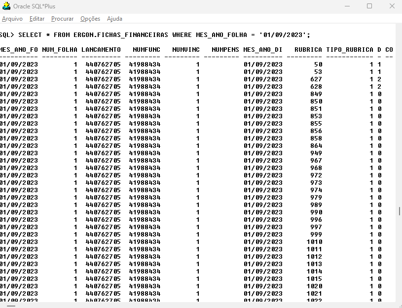
```
]
---
### WHERE
**Exemplo 6:** Usando **WHERE** para coluna não selecionada.  
```{sql eval = F}
SELECT DISTINCT NUM_FOLHA, RUBRICA 
FROM ERGON.FICHAS_FINANCEIRAS 
WHERE MES_ANO_FOLHA = '01/09/2023';
```

.pull-left[
<p style='font-size:15px;align=justify'>
Toda instrução <strong>SELECT</strong> básica começa com a palavra-chave <strong>SELECT</strong> seguida do nome de uma ou mais colunas que serão exibidas para o usuário. Depois vem a palavra <strong>FROM</strong> seguida do nome de uma tabela (as colunas exibidas devem pertencer a esta tabela).
Caso seja necessário restringir linhas, utiliza-se a cláusula <strong>WHERE</strong> associada a um ou mais testes sobre colunas da tabela indicada na cláusula <strong>FROM</strong>. É importante deixar claro que existe uma independência entre as colunas exibidas e as colunas testadas. Em outras palavras: é possível envolver colunas em testes da cláusula <strong>WHERE</strong> mesmo que elas não façam parte da lista de colunas a serem recuperadas no <strong>SELECT</strong>. A única exigência é que todas as colunas façam parte da(s) tabela(s) indicada(s) na cláusula <strong>FROM</strong>. 
</p>
]
.pull-right[
```{r echo=FALSE, out.width="80%", fig.align='center', dpi=600}
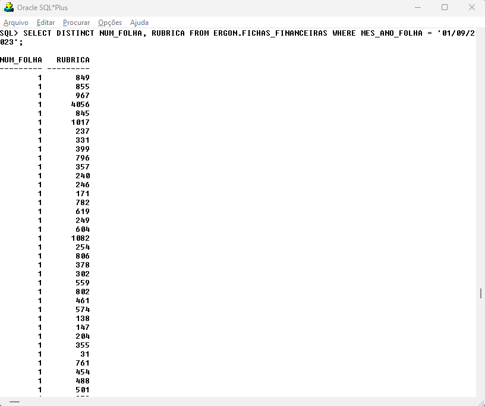
```
]
---
### WHERE
#### **Operadores Lógicos:** São usados para testar a legitimidade de algumas condições. Os operadores lógicos, como operadores de comparação, retornam um tipo de dados booleano com um valor <strong style="color:red;">TRUE</strong>, <strong style="color:red;">FALSE</strong> ou <strong style="color:red;">UNKNOWN</strong> (verdadeiro, falso ou desconhecido). 

```{r tabela3, echo=F}
tibble::tibble(
  OPERADOR = c("AND",
                "OR",
                "NOT"), 
  SIGNIFICADO = c('Retorna <a style="color:red">TRUE</a> se todas as condições avaliadas forem verdadeiras.',
                  'Retorna <a style="color:red">TRUE</a> se ao menos uma das condições avaliadas for verdadeira.',
                  'Retorna <a style="color:red">TRUE</a> se a condição seguinte for <a style="color:red">FALSE</a>.')
) |> 
  gt::gt() |> 
  gt::tab_style(style = gt::cell_text(weight = "bold",size = 18), 
                locations = gt::cells_column_labels()) |> 
  gt::tab_style(style = gt::cell_text(weight = "bold",size = 22), 
                locations = gt::cells_body()) |> 
  gt::fmt_markdown(columns = 'SIGNIFICADO') |> 
  gt::opt_stylize(style = 5, color = "blue", add_row_striping = F)

```

---
### WHERE
**Exemplo 7:** Usando **WHERE** com operador lógico **AND** (E).  

```{sql eval = F}
SELECT *  
FROM ERGON.FICHAS_FINANCEIRAS 
WHERE MES_ANO_FOLHA = '01/09/2023' AND NUM_FOLHA = 1;
```
.pull-left[
O operador lógico **AND** retorna as linhas para as quais ambas as condições são verdadeiras. No exemplo, a consulta retorna todos os registros com **MES_ANO_FOLHA** igual a <strong style="color:red;">01/09/2023</strong> e **NUM_FOLHA** igual a <strong style="color:red;">1</strong>. 

]
.pull-right[
```{r echo=FALSE, out.width="80%", fig.align='center', dpi=600}
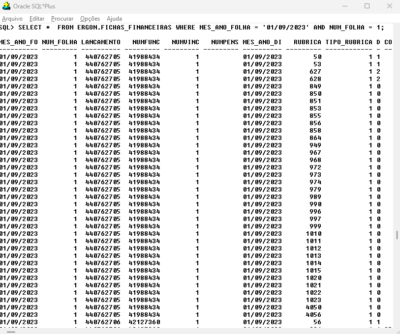
```
]
---
### WHERE
**Exemplo 8:** Usando **WHERE** com operador lógico **OR** (OU).  

```{sql eval = F}
SELECT DISTINCT MES_ANO_FOLHA, NUM_FOLHA  
FROM ERGON.FICHAS_FINANCEIRAS 
WHERE MES_ANO_FOLHA = '01/08/2023' OR MES_ANO_FOLHA = '01/09/2023' 
ORDER BY 2;
```
.pull-left[
O operador lógico **OU** retorna as linhas para as quais uma ou mais condições são verdadeiras. No exemplo, a consulta retorna todos os registros com **MES_ANO_FOLHA** igual a <strong style="color:red;">01/08/2023</strong> ou a igual a <strong style="color:red;">01/09/2023</strong>. 

]
.pull-right[
```{r echo=FALSE, out.width="90%", fig.align='center', dpi=600}
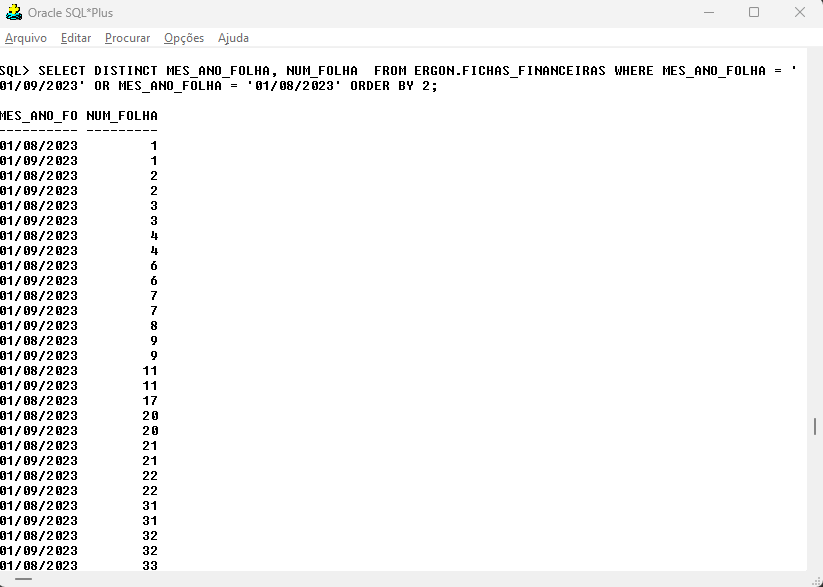
```
]
---
### WHERE
**Exemplo 9:** Usando **WHERE** com operador lógico **NOT** (NÃO).  

```{sql eval = F}
SELECT DISTINCT MES_ANO_FOLHA, NUM_FOLHA  
FROM ERGON.FICHAS_FINANCEIRAS 
WHERE MES_ANO_FOLHA = '01/08/2023' AND NOT (NUM_FOLHA = 1);
```
.pull-left[
O operador lógico **NOT** retorna as linhas para as quais a condição é falsa. No exemplo, a consulta retorna todos os registros com **MES_ANO_FOLHA** igual a <strong style="color:red;">01/08/2023</strong> e cujo **NUM_FOLHA** não é a igual a <strong style="color:red;">1</strong>. 

]
.pull-right[
```{r echo=FALSE, out.width="90%", fig.align='center', dpi=600}

```
]
---
### WHERE
**Exemplo 10:** Usando **WHERE** com operador lógico **NOT** (NÃO) com mais de uma condição.  

```{sql eval = F}
SELECT DISTINCT MES_ANO_FOLHA, NUM_FOLHA  
FROM ERGON.FICHAS_FINANCEIRAS 
WHERE MES_ANO_FOLHA = '01/08/2023' 
AND NOT (NUM_FOLHA = 1 OR NUM_FOLHA = 2 OR NUM_FOLHA = 3);
```
.pull-left[
O operador lógico **NOT** retorna as linhas para as quais a condição é falsa. No exemplo, a consulta retorna todos os registros com **MES_ANO_FOLHA** igual a <strong style="color:red;">01/08/2023</strong> e cujo **NUM_FOLHA** não é a igual a <strong style="color:red;">1</strong>, <strong style="color:red;">2</strong> ou <strong style="color:red;">3</strong>. 

]
.pull-right[
```{r echo=FALSE, out.width="90%", fig.align='center', dpi=600}
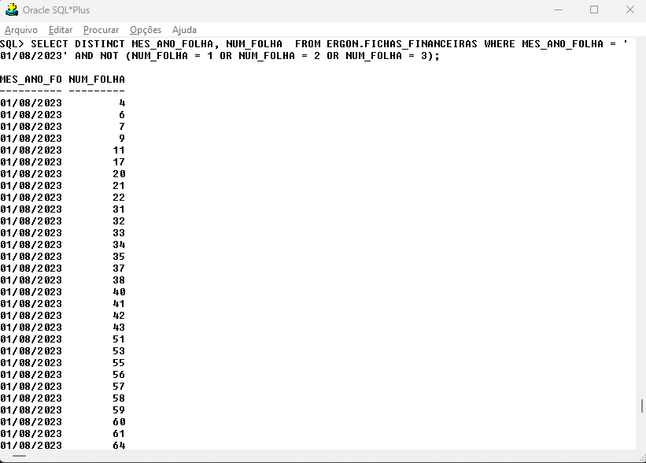
```
]
---
### WHERE
#### Regras de precedência para operadores lógicos

O operador **NOT** tem precedência maior, seguido do operador **AND** e do operador **OR**, respectivamente. Estas regras de precedência podem ser sobrepostas através do uso de parênteses.


```{r tabela_p, echo=F}
tibble::tibble(
  OPERADOR = c("NOT",
                "AND",
                "OR"), 
  `ORDEM DE AVALIAÇÃO` = 1:3) |> 
  gt::gt() |> 
  gt::tab_style(style = gt::cell_text(weight = "bold",size = 18), 
                locations = gt::cells_column_labels()) |> 
  gt::tab_style(style = gt::cell_text(weight = "bold",size = 22), 
                locations = gt::cells_body()) |> 
  gt::opt_stylize(style = 5, color = "blue", add_row_striping = F)

```

---
### WHERE
#### Regras de precedência para operadores lógicos

Suponha que um usuário deseja obter uma lista de rubricas presentes nas folhas 1 dos meses de agosto e setembro. Uma consulta com cláusula **WHERE** igual a *"WHERE MES_ANO_FOLHA = '01/08/2023' OR <mark>MES_ANO_FOLHA = '01/09/2023' AND NUM_FOLHA = 1</mark>"* **não atenderia** o desejo do usuário. Como o operador **AND** tem precedência maior do que o operador **OR**, o SGBD testa a condição destacada primeiro. 

.pull-left[
```{r echo=FALSE, out.width="30%", fig.align='center', dpi=600}
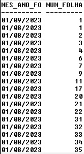
```
]
.pull-right[
Para obter o resultado correto, o usuário deveria escrever a consulta com a cláusula **WHERE** igual a *"(WHERE MES_ANO_FOLHA = '01/08/2023' OR MES_ANO_FOLHA = '01/09/2023') AND NUM_FOLHA = 1"*, que retorna os registros cujo MES_ANO_FOLHA é igual a '01/08/2023' ou '01/09/2023' e cujo NUM_FOLHA é 1.

]
---
### WHERE
#### **Definição 3**: Sintaxe da cláusula **WHERE**
A cláusula **WHERE** é utilizada para restringir as linhas que serão retornadas ou analisadas por uma consulta, de acordo com um ou mais critérios. Trata-se de uma cláusula opcional, ao contrário de **SELECT** e **FROM**, que são cláusulas obrigatórias. Dentro de um comando SQL, a palavra-chave **WHERE** deve ser colocada logo após a lista de tabelas associadas à cláusula **FROM** (Obs.: a cláusula **FROM** conterá mais de uma tabela sempre que for necessário realizar uma operação de junção; porém este assunto será abordado apenas nas próximas aulas). Além disso, a palavra-chave **WHERE** deve possuir uma ou mais condições associadas.
```{sql eval = F}
SELECT [DISTINCT] * | col 1 [AS apelido 1], ..., col n [AS apelido n]
FROM tabela
[WHERE condição(ões)];
```
---
### WHERE
#### **Operadores de comparação:** São usados para analisar valores de uma expressão e retornar um valor booleano.

```{r tabela4, echo=F}
tibble::tibble(
  OPERADOR = c("=",
                "<>",
                ">",
               ">=",
               "<",
               "<=",
               "BETWEEN",
               "IN",
               "LIKE"), 
  SIGNIFICADO = c('Igual a',
                  'Diferente de',
                  'Maior do que',
                  'Maior ou igual a',
                  'Menor do que',
                  'Menor ou igual a',
                  'Verifica se valor está dentro de uma determinada faixa de valores',
                  'Verifica se valor pertence a um determinado conjunto de valores',
                  'Busca texto (valor alfanumérico) em uma determinada string (sequência de caracteres alfanuméricos)')
) |> 
  gt::gt() |> 
  gt::tab_style(style = gt::cell_text(weight = "bold",size = 22), 
                locations = gt::cells_column_labels()) |> 
  gt::tab_style(style = gt::cell_text(weight = "bold",size = 22), 
                locations = gt::cells_body()) |> 
  gt::fmt_markdown(columns = 'SIGNIFICADO') |> 
  gt::opt_stylize(style = 5, color = "blue", add_row_striping = F)

```

---
### WHERE
**Exemplo 11:** Usando **WHERE** com operador de comparação **<>** (diferente de...).

```{sql eval = F}
SELECT DISTINCT MES_ANO_FOLHA, NUM_FOLHA  
FROM ERGON.FICHAS_FINANCEIRAS 
WHERE MES_ANO_FOLHA = '01/08/2023' AND NUM_FOLHA <> 1;
```

.pull-left[
O uso de operadores de comparação nos permite controlar de maneira simples o resultados das consultas. Geralmente, podemos obter o mesmo resultado realizando diferentes consultas. O exemplo acima retorna um resultado igual ao do Exemplo 9.  
]
.pull-right[
```{r echo=FALSE, out.width="90%", fig.align='center', dpi=600}
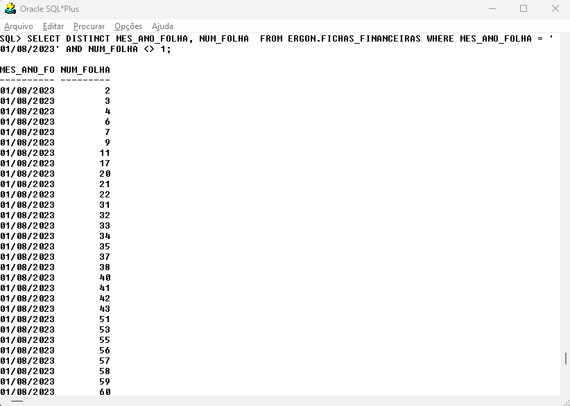
```
]
---
### WHERE
**Exemplo 12:** Usando **WHERE** com operador de comparação **>=** (maior ou igual a...).

```{sql eval = F}
SELECT DISTINCT MES_ANO_FOLHA, NUM_FOLHA  
FROM ERGON.FICHAS_FINANCEIRAS 
WHERE MES_ANO_FOLHA = '01/08/2023' AND NUM_FOLHA >= 90;
```

```{r echo=FALSE, out.width="50%", fig.align='center', dpi=600}
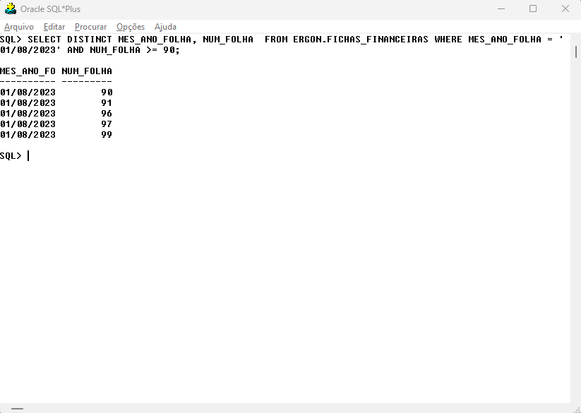
```
---
### WHERE
**Exemplo 13:** Usando **WHERE** com operador de comparação **BETWEEN** (entre...).
```{sql eval = F}
SELECT DISTINCT MES_ANO_FOLHA, NUM_FOLHA  
FROM ERGON.FICHAS_FINANCEIRAS 
WHERE MES_ANO_FOLHA = '01/09/2023' AND NUM_FOLHA BETWEEN 1 AND 10;
```
.pull-left[
O operador de comparação **BETWEEN** retorna todas as linhas cujos valores estejam **contidos em um intervalo**, incluindo as "pontas". Para este operador, o **limite inferior deve ser especificado inicialmente**.  
]
.pull-right[
```{r echo=FALSE, out.width="100%", fig.align='center', dpi=600}
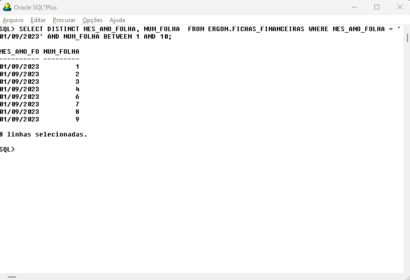
```
]
---
### WHERE
**Exemplo 14:** Usando **WHERE** com operador de comparação **BETWEEN** (entre...) com dados alfanuméricos.
```{sql eval = F}
SELECT DISTINCT MES_ANO_FOLHA, COMPLEMENTO  
FROM ERGON.FICHAS_FINANCEIRAS 
WHERE MES_ANO_FOLHA = '01/09/2023' AND COMPLEMENTO BETWEEN 'A' AND 'C';
```
.pull-left[
O operador **BETWEEN** também pode ser usado com datas (Ex.: *MES_ANO_FOLHA BETWEEN '01/07/2023' AND '15/08/2023'*) ou dados alfanuméricos.
]
.pull-right[
```{r echo=FALSE, out.width="100%", fig.align='center', dpi=600}
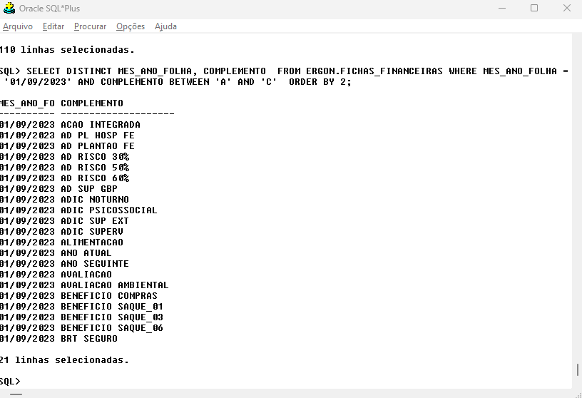
```
]
---
### WHERE
**Exemplo 15:** Usando **WHERE** com operador de comparação **IN** (pertence a...).
```{sql eval = F}
SELECT DISTINCT MES_ANO_FOLHA, NUM_FOLHA  
FROM ERGON.FICHAS_FINANCEIRAS 
WHERE MES_ANO_FOLHA IN ('01/01/2023','01/06/2023') 
ORDER BY 2;
```

.pull-left[
O operador **IN** retorna todas as linhas cujos valores pertencem a um determinado conjunto, que deve ser especificado entre partênteses. Este operador pode ser utilizado tanto para avaliar campos **alfanuméricos**, como para a avaliação de campos **numéricos** do tipo inteiro.
]
.pull-right[
```{r echo=FALSE, out.width="90%", fig.align='center', dpi=600}
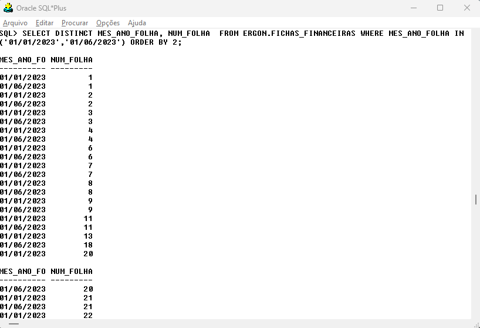
```
]
---
### WHERE
**Exemplo 16:** Usando **WHERE** com operador de comparação **NOT IN** (não pertence a...).
```{sql eval = F}
SELECT DISTINCT MES_ANO_FOLHA, NUM_FOLHA  
FROM ERGON.FICHAS_FINANCEIRAS 
WHERE MES_ANO_FOLHA = '01/08/2023' AND NUM_FOLHA NOT IN (1,2,3);
```

.pull-left[
O operador **NOT IN** retorna todas as linhas cujos valores **não pertencem** a um determinado conjunto.
]
.pull-right[
```{r echo=FALSE, out.width="100%", fig.align='center', dpi=600}
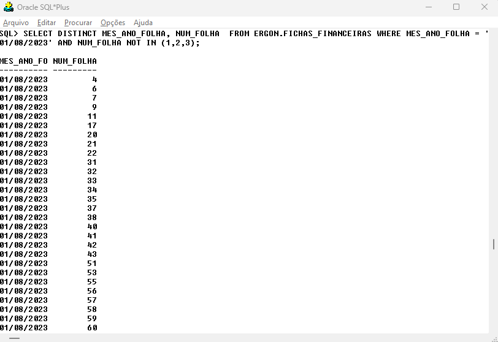
```
]
---
### WHERE
**Exemplo 17:** Usando **WHERE** com operador de comparação **LIKE**.
```{sql eval = F}
SELECT DISTINCT MES_ANO_FOLHA, COMPLEMENTO  
FROM ERGON.FICHAS_FINANCEIRAS 
WHERE MES_ANO_FOLHA = '01/08/2023' AND COMPLEMENTO LIKE 'ADIC%';
```

.pull-left[
<p style='font-size:15px;align=justify'>
O operador <strong>LIKE</strong> é usado para buscar um determinado padrão alfanumérico em uma coluna. É usado em conjunto com os caractéres especiais <strong>%</strong> e <strong>_</strong>.
<ul style='font-size:15px;align=justify'>
<li> O caractere <strong>%</strong> é corresponde a zero, um ou vários caracteres em uma string. Por exemplo se usarmos <strong>"LIKE 'a%'"</strong>, encontraremos qualquer string que comece com a letra 'a', seguida por zero, um ou vários caracteres, como 'azul', 'atividade', 'a', etc.
<li>O caractere <strong>_</strong> corresponde a exatamente um caractere qualquer em uma string. Por exemplo, se usarmos <strong>"LIKE '_mar'"</strong>, encontraremos strings com 4 caracteres e que terminem com 'mar', como 'amar' e 'Omar'. 
</ul>
</p>
]
.pull-right[
```{r echo=FALSE, out.width="100%", fig.align='center', dpi=600}
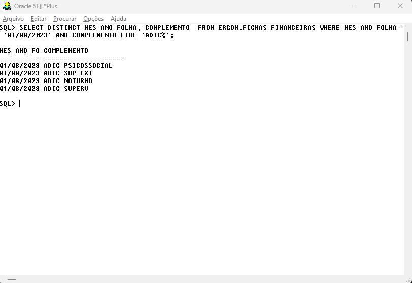
```
]
---
### FUNÇÃO DESC
A função **DESC** fornece a descrição de uma determinada tabela. A consulta retorna os nomes das colunas, se podem ou não assumir o valor null e o tipo de cada coluna. 
</br></br>
**Exemplo 18:** Descrição da tabela <strong style="color:red;">ERGON.FUNCIONARIOS</strong>.
```{sql eval = F}
DESC ERGON.FUNCIONARIOS;
```

```{r echo=FALSE, out.width="50%", fig.align='center', dpi=600}
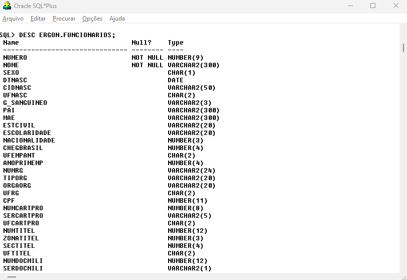
```

---
### EXERCÍCIOS

1. Crie uma consulta para recuperar todos os códigos de empresa (**EMP_CODIGO**) únicos para o mês de janeiro de 2023 usando a tabela <strong style="color:red;">ERGON.FICHAS_FINANCEIRAS</strong>.

2. Crie uma consulta para recuperar todas as rubricas e seus nomes usando a tabela <strong style="color:red;">ERGON.RUBRICAS</strong>.

3. Crie uma consulta para recuperar seu número de funcionário (**NUMERO**) usando a tabela <strong style="color:red;">ERGON.FUNCIONARIOS</strong>.

4. Com seu número de funcionário (**NUMFUNC**), crie uma consulta para recuperar sua data de posse (**DTPOSSE**), número do vínculo (**NUMERO**) e tipo de vínculo (**TIPOVINC**) usando a tabela <strong style="color:red;">ERGON.VINCULOS</strong>. 

5. Com seu número de funcionário (**NUMFUNC**) e número do vínculo (**NUMVINC**), crie uma consulta para recuperar a Data início (**DTINI**) e quantidade de triênio (**VALOR**) usando a tabela <strong style="color:red;">ERGON.VANTAGENS</strong> com o campo **VANTAGEM** igual a "TRIENIO LIMITE-AUTO". 
</br>
<small>*DICA: O triênio mais recente terá data fim (DTFIM) nula (Ex.: WHERE DTFIM IS NULL)*.</small>

---
### WHERE

**Exemplo 19:** Operações matemáticas na cláusula **WHERE**.
```{sql eval = F}
SELECT DISTINCT MES_ANO_FOLHA, NUM_FOLHA, RUBRICA, VALOR 
FROM ERGON.FICHAS_FINANCEIRAS 
WHERE MES_ANO_FOLHA = '01/09/2023' AND NUM_FOLHA = 55 AND RUBRICA IN (50,53) AND (VALOR * 2) > 100;
```

.pull-left[
É possível realizar operações aritméticas sobre as colunas na cláusula **WHERE**. Usamos **"+", "-", "*" e "/"** como operadores de adição, subtração, multiplicação e divisão, respectivamente.
]
.pull-right[
```{r echo=FALSE, out.width="90%", fig.align='center', dpi=600}
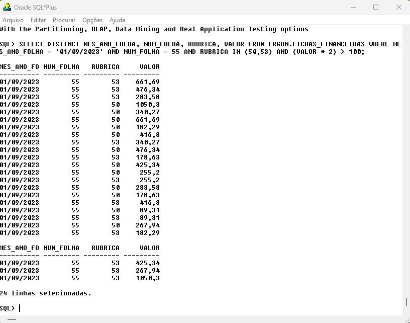
```
]
---
### SELECT

**Exemplo 20:** Operações matemáticas na cláusula **SELECT**.
```{sql eval = F}
SELECT DISTINCT MES_ANO_FOLHA, NUM_FOLHA, RUBRICA, VALOR, (VALOR * 0.19) AS "VALOR EM DOLARES" 
FROM ERGON.FICHAS_FINANCEIRAS 
WHERE MES_ANO_FOLHA = '01/09/2023' AND NUM_FOLHA = 55 AND RUBRICA IN (50,53);
```


```{r echo=FALSE, out.width="50%", fig.align='center', dpi=600}
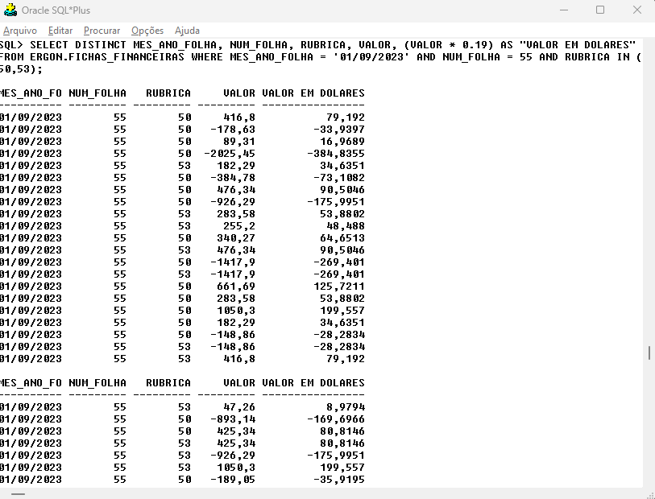
```
---
### <strong style="color:red;">NULL</strong>
**Exemplo 21:** Avaliando o valor **NULL**.
```{sql eval = F}
SELECT DISTINCT DTINI, DTFIM, VANTAGEM, VALOR, INFO 
FROM ERGON.VANTAGENS 
WHERE NUMFUNC = 2114007 AND NUMVINC = 3 AND DTFIM IS NULL AND INFO IS NOT NULL;
```

.pull-left[
<p style="font-size:15px">
O conceito de valor Nulo (ou <strong>NULL</strong>) é utilizado em banco de dados relacionais para representar a ausência de informação sobre um determinado campo. Detalhando melhor, se um campo de uma linha contém valor nulo, isto indica que seu conteúdo é desconhecido, inexistente, ou não-aplicável. 
É importante entender que nulo não é a mesma coisa que zero. Zero é um número! Considere, por exemplo, uma tabela que armazene os dados de funcionários de uma empresa. Se a coluna “número de filhos” de um funcionário armazena o valor 0, isso indica que este
não possui filhos (possui 0 filhos). Porém, se a coluna armazena o valor <strong>NULL</strong>, isto significa que não é sabido se o funcionário possui filhos ou não. De maneira análoga, também é importante ressaltar que o valor nulo não é a mesma coisa que espaço em branco, já que um espaço em branco representa um caractere. O operador <strong>IS NULL</strong> deve ser utilizado sempre que se desejar avaliar se um campo é nulo. Não funciona fazer o teste utilizando o operador “=” você precisa usar <strong>IS NULL</strong>.
</p>
]
.pull-right[
```{r echo=FALSE, out.width="90%", fig.align='center', dpi=600}
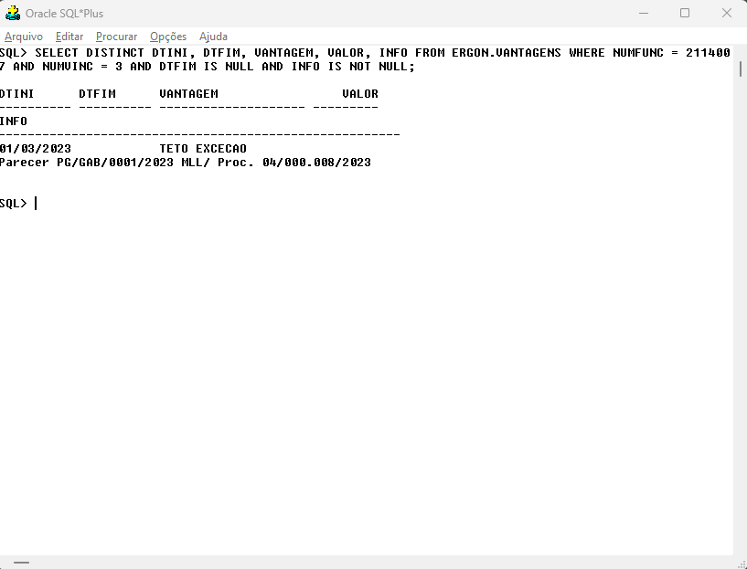
```
]


---
class: inverse, center, middle

# ORDER BY

---
class: center, middle

# Ordenando os resultados

---
### ORDER BY
Em muitas situações práticas pode existir a necessidade de especificar a ordem de exibição dos registros. A cláusula **ORDER BY** pode ser usada no final de um comando **SELECT** para ordenar or resultados.

**Exemplo 21:** Ordenando registros de uma tabela.
```{sql eval = F}
SELECT DISTINCT MES_ANO_FOLHA, NUM_FOLHA, RUBRICA, VALOR 
FROM ERGON.FICHAS_FINANCEIRAS 
WHERE MES_ANO_FOLHA = '01/09/2023' AND NUM_FOLHA = 55 AND RUBRICA = 996 
ORDER BY VALOR;
```

.pull-left[
Por definição, os resultados retornados após a execução de um comando **SELECT** não são ordenados por nenhum critério (ou seja: nenhuma coluna específica… o SGBD entrega os resultados na ordem que for “mais rápida” de buscá-los). No entanto, é possível especificar que os resultados sejam ordenados por uma ou mais colunas, através do uso da cláusula **ORDER BY**.
]
.pull-right[
```{r echo=FALSE, out.width="80%", fig.align='center', dpi=600}
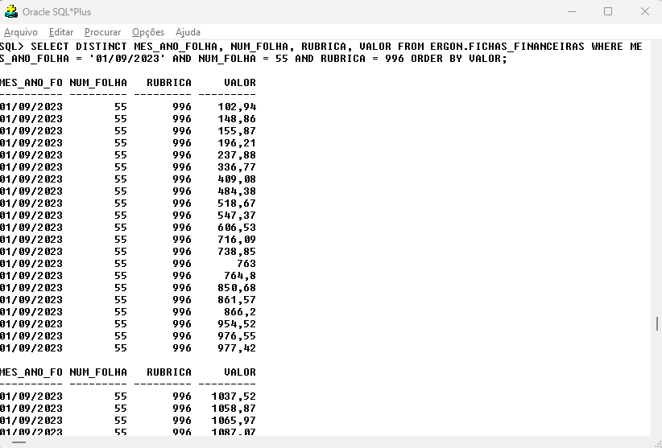
```
]
---
### ORDER BY

**Exemplo 22:** Ordenando registros de uma tabela usando mais de uma coluna.
```{sql eval = F}
SELECT DISTINCT MES_ANO_FOLHA, NUM_FOLHA, RUBRICA, VALOR 
FROM ERGON.FICHAS_FINANCEIRAS 
WHERE MES_ANO_FOLHA = '01/09/2023' AND NUM_FOLHA = 55 AND RUBRICA IN (50,53) 
ORDER BY VALOR, RUBRICA;
```

.pull-left[
Ao usar mais de uma coluna com a cláusula **ORDER BY**, o resultado é ordenado de maneira **ascendente** respeitando a ordem das colunas na cláusula (ordena primeiro com base na *COLUNA 1*, depois com base na *COLUNA 2*). Não há limite para o número de colunas a serem
especificadas na cláusula **ORDER BY**.
]
.pull-right[
```{r echo=FALSE, out.width="90%", fig.align='center', dpi=600}
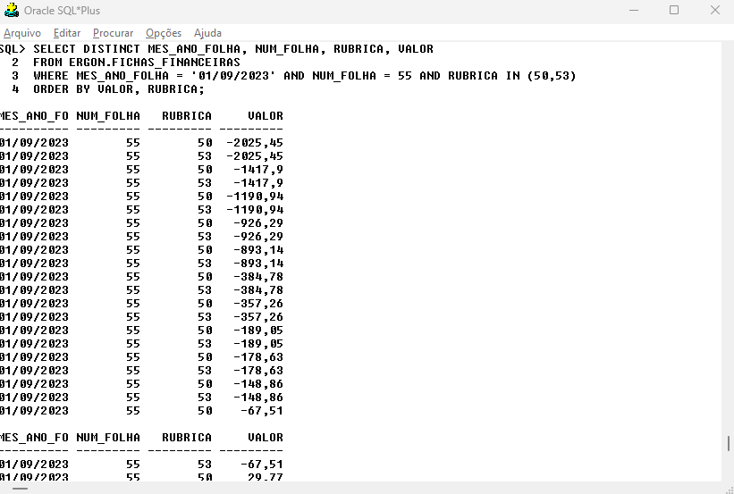
```
]
---
### ORDER BY
**Exemplo 23:** Ordenação decrescente de registros.
```{sql eval = F}
SELECT DISTINCT MES_ANO_FOLHA, NUM_FOLHA, RUBRICA, VALOR 
FROM ERGON.FICHAS_FINANCEIRAS 
WHERE MES_ANO_FOLHA = '01/09/2023' AND NUM_FOLHA = 55 AND RUBRICA IN (50,53) 
ORDER BY VALOR DESC, RUBRICA ASC;
```

.pull-left[
Para ordenar registros de maneira **descendente**, usamos a palavra-chave **DESC** após o nome da coluna na cláusula **ORDER BY**. Podemos usar a palavra-chave **ASC** para definir uma ordenação **ascendente**, mas seu uso é opcional.
]
.pull-right[
```{r echo=FALSE, out.width="90%", fig.align='center', dpi=600}
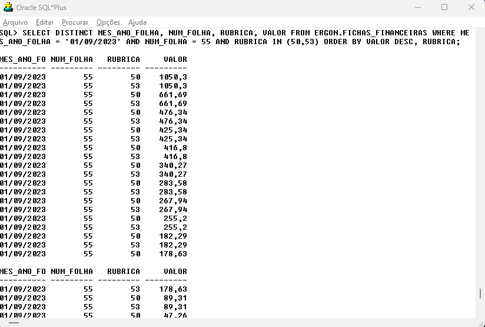
```
]
---
### ORDER BY
**Exemplo 24:** Ordenando registros por posição relativa de um campo.
```{sql eval = F}
SELECT DISTINCT MES_ANO_FOLHA, NUM_FOLHA, RUBRICA, VALOR 
FROM ERGON.FICHAS_FINANCEIRAS 
WHERE MES_ANO_FOLHA = '01/09/2023' AND NUM_FOLHA = 55 AND RUBRICA IN (50,53) 
ORDER BY 4, 3;
```

.pull-left[
Os SGBDs também permitem utilizar a cláusula ORDER BY para ordernar resultados pela posição relativa em um resultado, onde o primeiro campo do resultado tem a posição relativa 1, o campo seguinte 2, e assim por diante. O Exemplo 22 ordena a consulta pelos campos **VALOR** e **RUBRICA**, respectivamente. O resultado é identico ao resultado do Exemplo 20.
]
.pull-right[
```{r echo=FALSE, out.width="90%", fig.align='center', dpi=600}
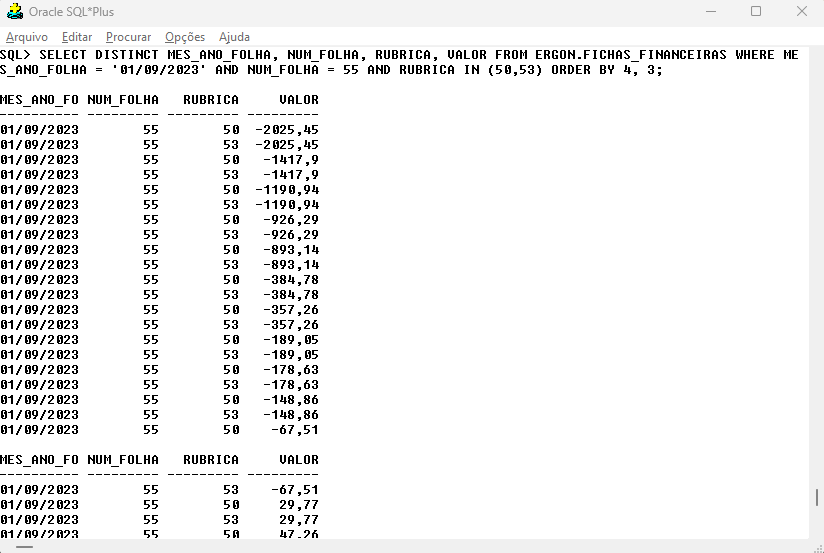
```
]
---
### ORDER BY
**Exemplo 25:** Ordenando registros usando campos não selecionados.
```{sql eval = F}
SELECT MES_ANO_FOLHA, NUM_FOLHA, RUBRICA, VALOR 
FROM ERGON.FICHAS_FINANCEIRAS 
WHERE MES_ANO_FOLHA = '01/09/2023' AND NUM_FOLHA = 55 AND RUBRICA IN (50,53)  
ORDER BY NUMFUNC;
```

.pull-left[
É possível ordenar registros usando colunas que não constam na cláusula **SELECT**, mas que fazem parte da tabela. Se a palavra-chave **DISTINCT** for usada na cláusula **SELECT** ou se a consulta contém a uma cláusula **GROUP BY** a coluna de ordenação deve estar na cláusula **SELECT**. Também podemos usar os termos **NULL LAST** e **NULL FIRST** para definir como valores **NULL** são avaliados. Com **NULL LAST**, os termos **NULL** aparecem no final da consulta. Com **NULL FIRST**, aparecem no início.
]
.pull-right[
```{r echo=FALSE, out.width="90%", fig.align='center', dpi=600}
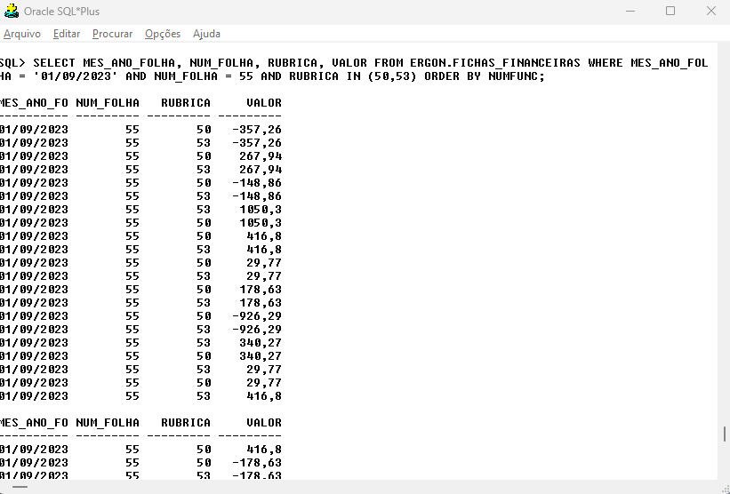
```
]
---
### ORDER BY
#### **Definição 4**: Cláusula **ORDER BY**
A ordem de exibição dos resultados de uma consulta pode ser especificada pela cláusula **ORDER BY**. Quando esta cláusula for utilizada, ela deverá ser sempre a última da instrução SQL. 
```{sql eval = F}
SELECT [DISTINCT] * | col 1 [AS apelido 1],..., col n [AS apelido n]
FROM tabela
[WHERE condição(ões)]
[ORDER BY lista de campos];
```

Na maioria dos SGBDs, os apelidos de colunas podem ser referenciados em uma cláusula **ORDER BY**, mas não podem ser referenciados em uma cláusula **WHERE**. 
---
### Exercícios

1. Crie uma consulta pra recuperar os 10 maiores valores da rubrica 999 da folha 1 de janeiro de 2023. 
</br>
<small>*DICA: Podemos restringir o total de linhas usando a palavra chave ROWNUM na cláusula WHERE (Ex.: WHERE ROWNUM <= 5)*.</small>

2. Modifique o **Exercício 2** sobre a cláusula **WHERE** e ordene o resultado pelo nome de maneira decrescente.

---
### Referências

* Material do Curso "Bases de Dados" - Prof. Eduardo Corrêa Gonçalves (ENCE/IBGE);
* Livro Introdução à linguagem SQL - Thomas Nield (O'REILLY);
* Documentação [SQL Language Reference](https://docs.oracle.com/en/database/oracle/oracle-database/19/sqlrf/index.html#Oracle%C2%AE-Database) (ORACLE)