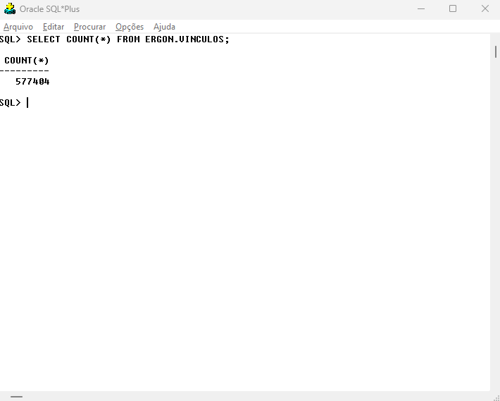
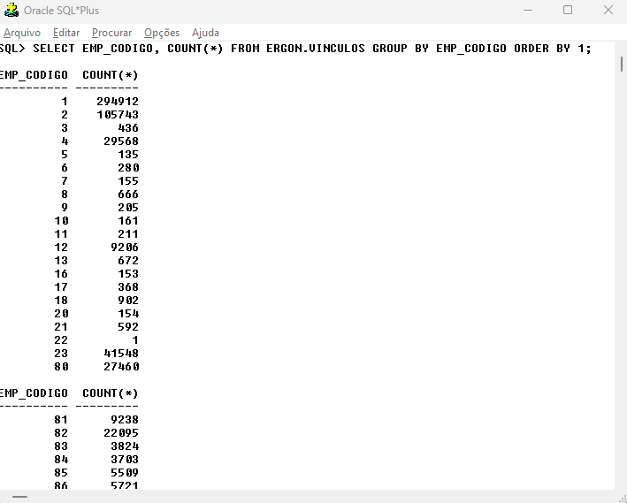
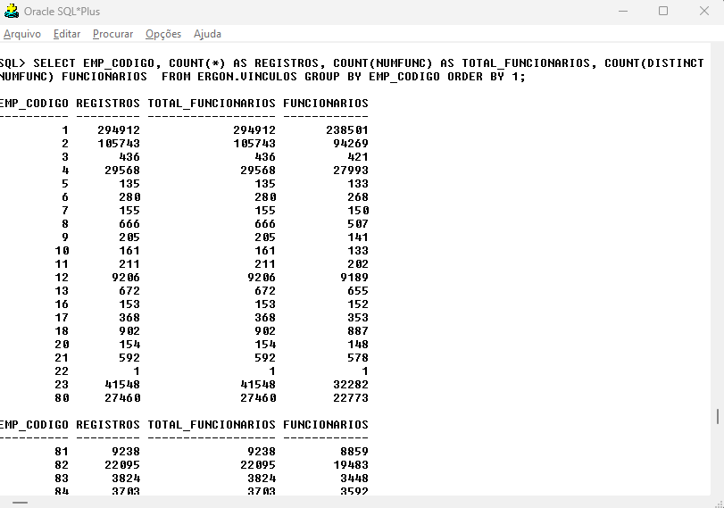
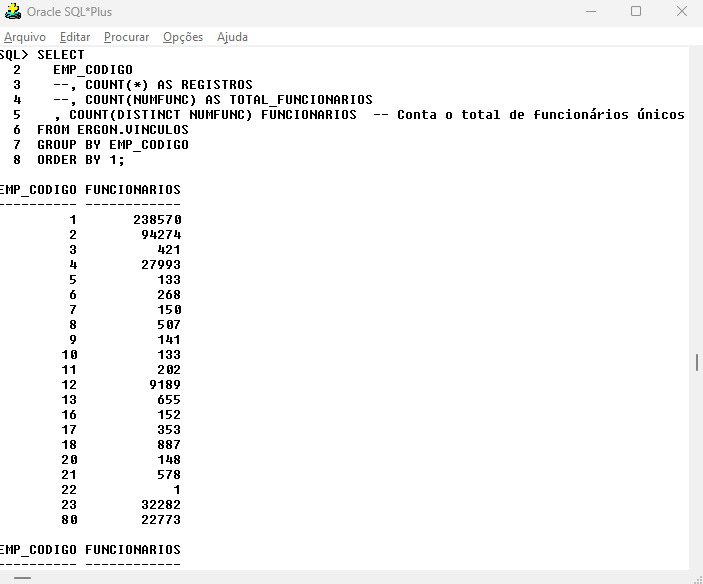
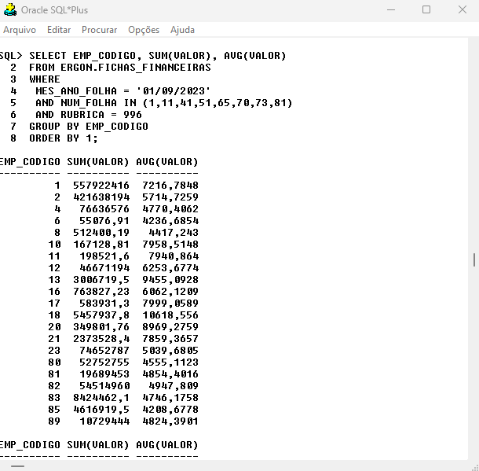
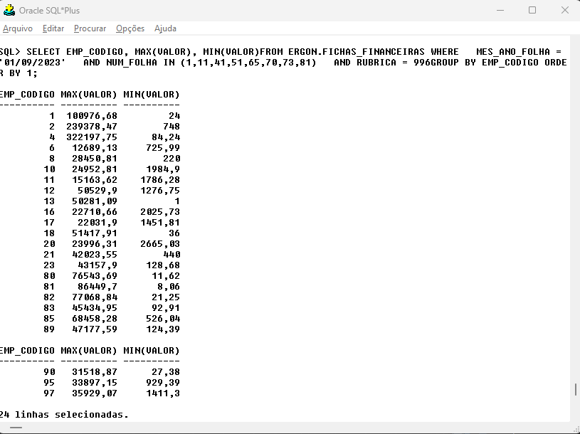
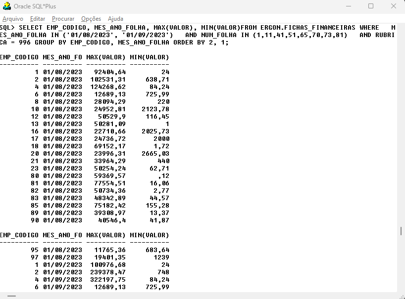
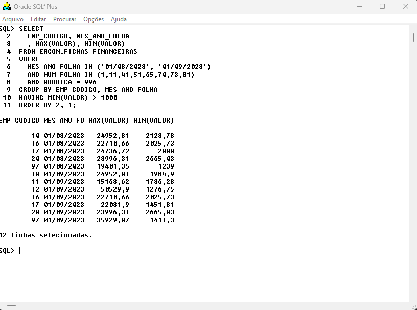
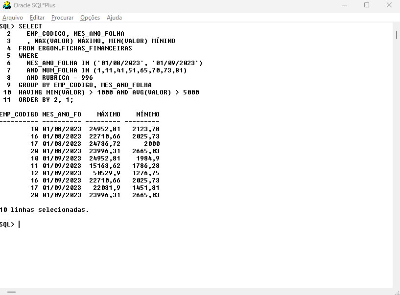

class: center, middle
```{r xaringan-themer, include=FALSE, warning=FALSE}
library(xaringanthemer)
style_mono_accent(
  base_color = "#004b80", 
  header_font_google = google_font("Josefin Sans"),
  text_font_google   = google_font("Montserrat", "300", "300i"),
  code_font_google   = google_font("Fira Mono"),
)
```

```{r xaringan-logo, echo=FALSE}
xaringanExtra::use_logo(
  image_url = "logo.png",
  position = xaringanExtra::css_position(top = "1em", right = "1em"),
  width = "200px"
)

```

# GROUP BY E FUNÇÕES DE GRUPO
---
class: inverse, center, middle

# Agregando conjuntos de dados

---
## GROUP BY

A agregação de dados é a criação de algum tipo de total ou resumo a partir de vários registros. Soma, mínimo, máximo, contagem e média são algumas das operações de agregação mais comuns. Podemos realizar essas operações sobre qualquer coluna especificada, o que nos permite controlar facilmente o escopo das agregações.

---
### FUNÇÕES DE GRUPO

**Exemplo 1:** Contabilizando todos os registros de uma tabela coma função **COUNT**.  
```{sql eval = F}
SELECT COUNT(*) 
FROM ERGON.VINCULOS;
```

.pull-left[
A função **COUNT** é usada para contabilizar registros em uma consulta. Também pode ser utilizada em consultas que possuem a cláusula **WHERE**.  
]
.pull-right[
```{r echo=FALSE, out.width="90%", fig.align='center', dpi=600}

```
]

---
### FUNÇÕES DE GRUPO

**Exemplo 2:** Contabilizando registros de uma tabela por grupos usando **COUNT** e **GROUP BY**. 
.pull-left[
```{sql eval = F}
SELECT EMP_CODIGO, COUNT(*) 
FROM ERGON.VINCULOS 
GROUP BY EMP_CODIGO 
ORDER BY 1;
```


A cláusula **GROUP BY** pode ser combinada com a função **COUNT** para recuperar o total de registros agrupados por determinada coluna. O formato resultante é conhecido como *tabulação* e conta a quantidade de valores unicos para cada grupo. 
]
.pull-right[
```{r echo=FALSE, out.width="100%", fig.align='center', dpi=600}

```
]

---
### FUNÇÕES DE GRUPO

**Exemplo 3:** Contabilizando registros únicos de uma coluna por grupos usando **DISTINCT**.  
.pull-left[
```{sql eval = F}
SELECT 
    EMP_CODIGO
    , COUNT(*) AS REGISTROS
    , COUNT(NUMFUNC) AS TOTAL_FUNCIONARIOS
    , COUNT(DISTINCT NUMFUNC) FUNCIONARIOS  
FROM ERGON.VINCULOS 
GROUP BY EMP_CODIGO 
ORDER BY 1;
```


Por padrão, o SGBD contabiliza todos os registros não nulos de uma coluna ao usar a função **COUNT**. Se desejamos contabilizar os valores únicos, devemos usar a palavra-chave **DISTINCT** antes do nome da coluna e dentro dos parênteses da função **COUNT**.
]

.pull-right[
```{r echo=FALSE, out.width="100%", fig.align='center', dpi=600}

```
]

---
### COMENTANDO O CÓDIGO

**Exemplo 4:** Impedindo a execução de parte do código.  
.pull-left[
```{sql eval = F}
SELECT 
    EMP_CODIGO   
    --, COUNT(*) AS REGISTROS
    --, COUNT(NUMFUNC) AS TOTAL_FUNCIONARIOS
    , COUNT(DISTINCT NUMFUNC) FUNCIONARIOS  -- Conta o total de funcionários únicos 
FROM ERGON.VINCULOS 
GROUP BY EMP_CODIGO 
ORDER BY 1; 
/* Estas linhas 
não serão executadas */
```

<p style="font-size:16px">
Ao digitar uma consulta, pode ser útil escrever um comentário explicando o código. Podemos, também, estar interessados em que parte do código não seja executado naquele momento. Podemos usar os símbolos <strong>"--"</strong>. Todo código posicionado entre <strong>"--"</strong> e o final da linha serão ignorados (não serão executados). Para comentar múltiplas linhas, usamos os simbolos <strong>"/*"</strong> e <strong>"*/"</strong>. Tudo que estiver contido entre eles será ignorado.
</p>
]
.pull-right[
```{r echo=FALSE, out.width="100%", fig.align='center', dpi=600}

```
]

---
### FUNÇÕES DE GRUPO
**Exemplo 5:** Somando e calculando a média de registros por grupo usando **SUM** e **AVG**.
.pull-left[
```{sql eval = F}
SELECT EMP_CODIGO, SUM(VALOR), AVG(VALOR) 
FROM ERGON.FICHAS_FINANCEIRAS 
WHERE 
  MES_ANO_FOLHA = '01/09/2023' 
  AND NUM_FOLHA IN (1,11,41,51,65,70,73,81) 
  AND RUBRICA = 996 
GROUP BY EMP_CODIGO 
ORDER BY 1;
```
]
.pull-right[
```{r echo=FALSE, out.width="90%", fig.align='center', dpi=600}

```
]
---
### FUNÇÕES DE GRUPO
**Exemplo 6:** Calculando valores máximos e mínimos de registros por grupo usando **MAX** e **MIN**.
.pull-left[
```{sql eval = F}
SELECT EMP_CODIGO, MAX(VALOR), MIN(VALOR)
FROM ERGON.FICHAS_FINANCEIRAS 
WHERE 
    MES_ANO_FOLHA = '01/09/2023' 
    AND NUM_FOLHA IN (1,11,41,51,65,70,73,81) 
    AND RUBRICA = 996
GROUP BY EMP_CODIGO 
ORDER BY 1;
```
]
.pull-right[
```{r echo=FALSE, out.width="100%", fig.align='center', dpi=600}

```
]
---
### FUNÇÕES DE GRUPO
**Exemplo 7:** Usando funções de grupo com mais de uma coluna.
.pull-left[
```{sql eval = F}
SELECT 
    EMP_CODIGO, MES_ANO_FOLHA
    , MAX(VALOR), MIN(VALOR)
FROM ERGON.FICHAS_FINANCEIRAS 
WHERE 
    MES_ANO_FOLHA IN ('01/08/2023', '01/09/2023') 
    AND NUM_FOLHA IN (1,11,41,51,65,70,73,81) 
    AND RUBRICA = 996 
GROUP BY EMP_CODIGO, MES_ANO_FOLHA 
ORDER BY 2, 1;
```


Se desejamos grupar usando mais de uma coluna como categoria, podemos simplesmente listar essas colunas na cláusula **GROUP BY**. Isso criará grupos com base nas combinações únicas das colunas listadas. Ao usar funções de grupo, todas as colunas que constam na cláusula **SELECT** e não estão sendo avaliadas dentro de uma função de grupo devem constar na cláusula **GROUP BY**.
]
.pull-right[
```{r echo=FALSE, out.width="100%", fig.align='center', dpi=600}

```
]
---
### FUNÇÕES DE GRUPO
**Exemplo 8:** Usando funções de grupo para restringir conjuntos de dados usando **HAVING**.

```{sql eval = F}
SELECT 
    EMP_CODIGO, MES_ANO_FOLHA
    , MAX(VALOR), MIN(VALOR)
FROM ERGON.FICHAS_FINANCEIRAS 
WHERE 
    MES_ANO_FOLHA IN ('01/08/2023', '01/09/2023') 
    AND NUM_FOLHA IN (1,11,41,51,65,70,73,81) 
    AND RUBRICA = 996 
GROUP BY EMP_CODIGO, MES_ANO_FOLHA 
HAVING MIN(VALOR) > 1000
ORDER BY 2, 1;
```

Quando queremos restingir registros usando uma função de grupo, nossa intuição inicial pode ser usar a restrição na cláusula **WHERE**. Entretanto, campos agregados <strong style="color:red;">não podem</strong> constar na cláusula **WHERE**. O filtro deve ocorrer na cláusula **HAVING**. Isso ocorre por que, por padrão, o SGBD processa registro a registro definindo quais serão mantidos de acordo com a condição **WHERE**. Depois, agrupa os registros em **GROUP BY** e executa as funções de agregação. Portanto, se queremos restringir os dados com base nessa função de agregação, isso deve ocorrer depois do cálculo.

---
### FUNÇÕES DE GRUPO
**Exemplo 8:** Usando funções de grupo para restringir conjuntos de dados usando **HAVING**.


```{r echo=FALSE, out.width="60%", fig.align='center', dpi=600}

```

---
### FUNÇÕES DE GRUPO
**Exemplo 9:** Usando **HAVING** com mais de uma condição.

```{sql eval = F}
SELECT 
    EMP_CODIGO, MES_ANO_FOLHA
    , MAX(VALOR) MÁXIMO, MIN(VALOR) MÍNIMO
FROM ERGON.FICHAS_FINANCEIRAS 
WHERE 
    MES_ANO_FOLHA IN ('01/08/2023', '01/09/2023') 
    AND NUM_FOLHA IN (1,11,41,51,65,70,73,81) 
    AND RUBRICA = 996 
GROUP BY EMP_CODIGO, MES_ANO_FOLHA 
HAVING MIN(VALOR) > 1000 AND AVG(VALOR) > 5000 
ORDER BY 2, 1;
```

Podemos usar multiplas condições na cláusula **HAVING** usando operadores lógicos (**AND**, **OR**, **NOT**). Não é necessário que as funções usadas na cláusula **HAVING** também constem na cláusula **SELECT**. Também não é possível usar os apelidos das colunas na cláusula **HAVING**.

---
### FUNÇÕES DE GRUPO
**Exemplo 9:** Usando **HAVING** com mais de uma condição.

```{r echo=FALSE, out.width="60%", fig.align='center', dpi=600}

```

---
### FUNÇÕES DE GRUPO
#### **Definição 4**: Cláusula **GROUP BY**
O agrupamento de atributos de uma tabela pode ser realizado usando a cláusula **GROUP BY** e uma ou mais funções de grupo. Podemos, também, restringir o resultado de uma consulta usando a palavra-chave **HAVING** com uma ou mais funções de grupo.
```{sql eval = F}
SELECT [DISTINCT] col 1 [AS apelido 1],..., col n [AS apelido n] , [{SUM | MAX | MIN | AVG} (col x)], 
FROM tabela
[WHERE condição(ões)]
[GROUP BY col 1 ,..., col n ]
[HAVING condição(ões)]
[ORDER BY lista de campos];
```

Nos bancos de dados ORACLE não é possível usar apelidos de colunas nas cláusulas **GROUP BY** e **HAVING**, devido a ordem de avaliação interna do SGBD. 

---

### Exercícios

1. Crie uma consulta para encontrar a média dos encargos de fiscalização sanitária (**RUBRICA** = 200) em janeiro de 2023, usando a tabela <strong style="color:red;">ERGON.FICHAS_FINANCEIRAS</strong>.

2. Usando a tabela <strong style="color:red;">ERGON.CONS</strong>, que contém informações sobre as consignações dos servidores municipais, construa uma consulta que retorne os valores (**VALOR**) máximos das parcelas por rubrica (**RUBRICA**) para o mês de setembro (**DTINI** = '01/09/2023').   

3. Modifique a consulta anterior para agrupar também por empresa (**EMP_CODIGO**) e organizar os valores do maior para o menor.

---
class: center, middle

# SYSTEM TABLES

---
### SYSTEM TABLES
As System Tables, ou "tabelas do sistema", são um conjunto de tabelas internas do sistema de gerenciamento de banco de dados Oracle. Elas são usadas para armazenar informações essenciais sobre o próprio sistema, como detalhes sobre objetos do banco de dados, permissões de acesso, configurações do sistema e muito mais. 

```{r echo=F, warning=F}
# Lista traduzida
tibble::tribble(
  ~"NOME DA TABELA", ~"DESCRIÇÃO",
  "ALL_ARGUMENTS", "Argumentos em objeto acessível ao usuário",
  "ALL_CATALOG", "Todas as tabelas, visualizações, sinônimos, sequências acessíveis ao usuário",
  "ALL_COL_COMMENTS", "Comentários sobre colunas de tabelas e visualizações acessíveis",
  "ALL_CONSTRAINTS", "Definições de restrições em tabelas acessíveis",
  "ALL_CONS_COLUMNS", "Informações sobre colunas acessíveis em definições de restrições",
  "ALL_DB_LINKS", "Links de banco de dados acessíveis ao usuário",
  "ALL_ERRORS", "Erros atuais em objetos armazenados que o usuário pode criar",
  "ALL_INDEXES", "Descrições de índices em tabelas acessíveis ao usuário",
  "ALL_IND_COLUMNS", "Colunas que compõem índices em tabelas acessíveis",
  "ALL_LOBS", "Descrição de LOBs contidos em tabelas acessíveis ao usuário",
  "ALL_OBJECTS", "Objetos acessíveis ao usuário",
  "ALL_OBJECT_TABLES", "Descrição de todas as tabelas de objetos acessíveis ao usuário",
  "ALL_SEQUENCES", "Descrição de sequências acessíveis ao usuário",
  "ALL_SNAPSHOTS", "Snapshots aos quais o usuário pode acessar",
  "ALL_SOURCE", "Fonte atual em objetos armazenados que o usuário pode criar",
  "ALL_SYNONYMS", "Todos os sinônimos acessíveis ao usuário",
  "ALL_TABLES", "Descrição de tabelas relacionais acessíveis ao usuário",
  "ALL_TAB_COLUMNS", "Colunas de tabelas, visualizações e clusters do usuário",
  "ALL_TAB_COL_STATISTICS", "Colunas de tabelas, visualizações e clusters do usuário",
  "ALL_TAB_COMMENTS", "Comentários sobre tabelas e visualizações acessíveis ao usuário",
  "ALL_TRIGGERS", "Triggers acessíveis ao usuário atual",
  "ALL_TRIGGER_COLS", "Uso de colunas em triggers do usuário ou em triggers de tabelas do usuário",
  "ALL_TYPES", "Descrição de tipos acessíveis ao usuário",
  "ALL_UPDATABLE_COLUMNS", "Descrição de todas as colunas atualizáveis",
  "ALL_USERS", "Informações sobre todos os usuários do banco de dados",
  "ALL_VIEWS", "Descrição de visualizações acessíveis ao usuário",
  "DATABASE_COMPATIBLE_LEVEL", "Nível de compatibilidade do banco de dados configurado via init.ora",
  "DBA_DB_LINKS", "Todos os links de banco de dados no banco de dados",
  "DBA_ERRORS", "Erros atuais em todos os objetos armazenados no banco de dados",
  "DBA_OBJECTS", "Todos os objetos no banco de dados",
  "DBA_ROLES", "Todos os papéis existentes no banco de dados",
  "DBA_ROLE_PRIVS", "Papéis concedidos a usuários e papéis",
  "DBA_SOURCE", "Fonte de todos os objetos armazenados no banco de dados",
  "DBA_TABLESPACES", "Descrição de todos os espaços de tabela",
  "DBA_TAB_PRIVS", "Todas as concessões em objetos no banco de dados",
  "DBA_TRIGGERS", "Todos os triggers no banco de dados",
  "DBA_TS_QUOTAS", "Cotas de espaço de tabela para todos os usuários",
  "DBA_USERS", "Informações sobre todos os usuários do banco de dados",
  "DBA_VIEWS", "Descrição de todas as visualizações no banco de dados",
  "DICTIONARY", "Descrição de tabelas e visualizações de dicionário de dados",
  "DICT_COLUMNS", "Descrição de colunas em tabelas e visualizações de dicionário de dados",
  "GLOBAL_NAME", "Nome global do banco de dados",
  "NLS_DATABASE_PARAMETERS", "Parâmetros NLS permanentes do banco de dados",
  "NLS_INSTANCE_PARAMETERS", "Parâmetros NLS da instância",
  "NLS_SESSION_PARAMETERS", "Parâmetros NLS da sessão do usuário",
  "PRODUCT_COMPONENT_VERSION", "Informações de versão e status de produtos componentes",
  "ROLE_TAB_PRIVS", "Privilégios de tabela concedidos a papéis",
  "SESSION_PRIVS", "Privilégios atualmente definidos para o usuário",
  "SESSION_ROLES", "Papéis que o usuário tem atualmente habilitados",
  "SYSTEM_PRIVILEGE_MAP", "Tabela de descrição para códigos de tipo de privilégio. Mapeia números de tipo de privilégio para nomes de tipo",
  "TABLE_PRIVILEGES", "Concessões em objetos para as quais o usuário é o concedente, o destinatário, o proprietário ou um papel habilitado ou o PÚBLICO é o destinatário",
  "TABLE_PRIVILEGE_MAP", "Tabela de descrição para códigos de tipo de privilégio (opção de auditoria). Mapeia números de tipo de privilégio (opção de auditoria) para nomes de tipo"
) |> 
  gt::gt() |> 
  gt::tab_style(style = gt::cell_text(weight = "bold",size = 18), 
                locations = gt::cells_column_labels()) |> 
  gt::tab_style(style = gt::cell_text(weight = "bold",size = 22), 
                locations = gt::cells_body()) |> 
  gt::tab_options(container.height = 400) |> 
  gt::opt_stylize(style = 5, color = "blue", add_row_striping = F)

```

---
### BUSCANDO TABELAS

**Exemplo 9:** Usando a tabela <strong style="color:red;">ALL_TAB_COLUMNS</strong> para listar todas as tabelas do <strong style="color:red;">ERGON</strong>.
.pull-left[
```{sql eval = F}
SELECT DISTINCT TABLE_NAME
FROM ALL_TAB_COLUMNS
WHERE OWNER = 'ERGON'
ORDER BY TABLE_NAME;
```

Podemos usar a coluna **OWNER** para especificar o grupo/esquema e listar todas as tabelas pertencentes a esse esquema. No exemplo, podemos encontrar todas as tabelas no esquema <strong style="color:red;">ERGON</strong>.

]

.pull-right[
```{r echo=FALSE, out.width="100%", fig.align='center', dpi=600}

```
]
---
### BUSCANDO TABELAS

**Exemplo 10:** Usando a tabela <strong style="color:red;">ALL_TAB_COLUMNS</strong> para listar todas as tabelas que contém uma determinada coluna.
.pull-left[
```{sql eval = F}
SELECT DISTINCT TABLE_NAME
FROM ALL_TAB_COLUMNS
WHERE 
    OWNER = 'ERGON'
    AND COLUMN_NAME = 'NUMFUNC'
ORDER BY TABLE_NAME;
```


Usando a coluna **COLUMN_NAME**, podemos encontrar tabelas com colunas em comum. Isso será muito útil para unir tabelas usando **JOIN**, que será visto na parte 4 do curso.
]

.pull-right[
```{r echo=FALSE, out.width="100%", fig.align='center', dpi=600}

```
]

---
### Referências

* Material do Curso "Bases de Dados" - Prof. Eduardo Corrêa Gonçalves (ENCE/IBGE);
* Livro Introdução à linguagem SQL - Thomas Nield (O'REILLY);
* Documentação [SQL Language Reference](https://docs.oracle.com/en/database/oracle/oracle-database/19/sqlrf/index.html#Oracle%C2%AE-Database) (ORACLE)
* Lista de [SYSTEM TABLES](https://www.techonthenet.com/oracle/sys_tables/index.php)
