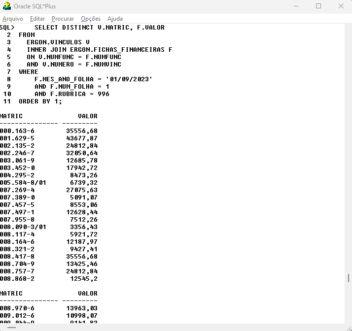

class: center, middle
```{r xaringan-themer, include=FALSE, warning=FALSE}
library(xaringanthemer)
style_mono_accent(
  base_color = "#004b80", 
  header_font_google = google_font("Josefin Sans"),
  text_font_google   = google_font("Montserrat", "300", "300i"),
  code_font_google   = google_font("Fira Mono"),
)
```

```{r xaringan-logo, echo=FALSE}
xaringanExtra::use_logo(
  image_url = "logo.png",
  position = xaringanExtra::css_position(top = "1em", right = "1em"),
  width = "200px"
)

```
# JOIN
---
class: inverse, center, middle

# JUNÇÕES DE TABELAS

---
### JOIN

As junções são utilizadas em instruções **SELECT** para recuperar dados de duas tabelas e “juntá-los” com o objetivo de produzir uma saída combinada. As tabelas envolvidas em uma junção precisam compartilhar dados em comum através de um ou mais atributos. Na maioria
das vezes (embora não necessariamente) estes atributos que “conectam” as tabelas estarão vinculados através de uma ligação Chave Primária-Chave Estrangeira.
</br></br>
Definimos **chave primária** como o atributo ou conjunto de atributos em uma tabela que identifica de forma exclusiva cada registro nessa tabela. Uma chave primária deve ser única, ou seja, não pode haver dois registros com o mesmo valor na coluna ou conjunto de colunas que compõem a chave primária. A chave primária também deve ser *não nula*, o que significa que cada registro deve ter um valor válido na chave primária.
</br>
Ex.: Atributo **NUMERO** na tabela <strong style="color:red;">FUNCIONARIOS</strong>.
</br></br>
Definimos **chave estrangeira** como o atributo ou conjunto de atributos em uma tabela estabelece uma relação entre essa tabela e outra tabela, geralmente por meio da chave primária da outra tabela.
</br>
Ex.: Atributo **NUMFUNC** na tabela <strong style="color:red;">FICHAS_FINANCEIRAS</strong>
---
### JOIN

**Exemplo 1:** Recuperando dados de duas tabelas com **NATURAL JOIN**.  

```{sql eval = F}
SELECT DISTINCT 
  ERGON.VINCULOS.MATRIC
  , ERGON.FICHAS_FINANCEIRAS.VALOR
FROM 
  ERGON.VINCULOS
  NATURAL JOIN ERGON.FICHAS_FINANCEIRAS
WHERE 
    ERGON.FICHAS_FINANCEIRAS.MES_ANO_FOLHA = '01/09/2023' 
    AND ERGON.FICHAS_FINANCEIRAS.NUM_FOLHA = 1 
    AND ERGON.FICHAS_FINANCEIRAS.RUBRICA = 996
ORDER BY 1;
```


<p style='font-size:20px'>
Junções entre tabelas são sempre realizadas aos pares e seguindo ordem especificada na cláusula <strong>FROM</strong>. Internamente, o SGBD realiza a <em>junção natural</em> das tabelas, gerando um resultado intermediário (uma relação temporária na memória de trabalho do SGBD). Neste resultado intermediário, teremos um conjunto contendo todas os registros da tabela <strong style="color:red;">VINCULOS</strong> corretamente “casados” com os registros de <strong style="color:red;">FICHAS_FINANCEIRAS</strong>. Conceitualmente, a operação de junção não descarta nenhum atributo do par de tabelas envolvidas. Por isso, o resultado intermediário contém todos os atributos de
<strong style="color:red;">VINCULOS</strong> e todos os de <strong style="color:red;">FICHAS_FINANCEIRAS</strong> (só uma versão de cada de <strong>NUMFUNC</strong> e <strong>NUMVINC</strong> são mantidos, pois esses atributos são comuns a ambas as tabelas).
</p>

---
### JOIN
**Exemplo 1:** Recuperando dados de duas tabelas com **NATURAL JOIN**.  

```{r echo=FALSE, out.width="50%", fig.align='center', dpi=600}
knitr::include_graphics("images/JOIN1.png")
```


---
### JOIN

**Exemplo 1:** Recuperando dados de duas tabelas com **NATURAL JOIN**.  
```{sql eval = F}
SELECT DISTINCT V.MATRIC, F.VALOR
FROM ERGON.VINCULOS V NATURAL JOIN ERGON.FICHAS_FINANCEIRAS F
WHERE 
    F.MES_ANO_FOLHA = '01/09/2023' 
    AND F.NUM_FOLHA = 1 
    AND F.RUBRICA = 996
ORDER BY 1;
```

O **NATURAL JOIN** é o modo mais simples de juntar tabelas, pois não é necessário explicitar com quais colunas estamos realizando o **JOIN**. O SGBD detecta automaticamente as colunas com mesmo nome nas duas tabelas. 
</br></br>
Para evitar a repetição de nomes longos, podemos podemos criar rótulos para as tabelas. Geralmente, adotamos uma ou duas letras para representar as tabelas. Os rótulos das tabelas podem ser usados em todas as cláusulas da consulta e são obrigatórios apenas para **remover ambiguidade**.

---
### JOIN

**Exemplo 2:** Junção interna com **INNER JOIN**. 

```{sql eval = F}
SELECT DISTINCT V.MATRIC, F.VALOR
FROM 
  ERGON.VINCULOS V 
  INNER JOIN ERGON.FICHAS_FINANCEIRAS F
  ON V.NUMFUNC = F.NUMFUNC
  AND V.NUMERO = F.NUMVINC
WHERE 
    F.MES_ANO_FOLHA = '01/09/2023' 
    AND F.NUM_FOLHA = 1 
    AND F.RUBRICA = 996
ORDER BY 1;
```


A junção interna (**INNER JOIN**) combina uma linha de uma tabela A com uma linha de uma tabela B *apenas quando há coincidência* nos valores das colunas especificadas na condição de junção. No exemplo, iniciamos definimos as colunas e seus apelidos e o tipo de junção a ser realizado. Depois, usando a palavra-chave **ON**, especificamos quais atributos ligam as duas tabelas. A ordem dos atributos após a palavra-chave **ON** é indiferente (*"ON V.NUMFUNC = F.NUMFUNC"* equivale a *"ON F.NUMFUNC = V.NUMFUNC"*). Podemos usar diversas duplas de colunas para realizar o **JOIN** usando o operador **AND**. 

---
### JOIN

**Exemplo 2:** Junção interna com **INNER JOIN**. 
.pull-left[
A partir do exemplo apresentado, é possível concluir que o **INNER JOIN** possui o mesmo propósito do **NATURAL JOIN**, oferecendo porém a vantagem de não exigir que a coluna de ligação possua o mesmo nome nas duas tabelas. Por essa razão, o **INNER JOIN** é muito mais utilizado na prática. No exemplo usando **NATURAL JOIN**, a junção foi realizada usando apenas a coluna **NUMFUNC**, que possui o mesmo nome em ambas as tabelas. Comparando com operações de conjuntos, realizar uma junção usando **INNER JOIN** equivale a *interseção* de duas tabelas.

```{r conjuntos, echo=FALSE, message=F, warning=F,out.width="40%", fig.align='center', dpi=600}
library(ggplot2)
library(patchwork)
library(ggforce)
library(dplyr)
library(latex2exp)

y=seq(-.75,.75, by=.001) 
x=sqrt(.75^2-y^2)
x2=x+1
y2=y+1
x3=-x+2
df=data.frame(x2,y2) |> 
    filter(y2<1+sqrt(.75^2-.5^2) & y2 > 1-sqrt(.75^2-.5^2)) |> 
    rbind(data.frame(x2=x3,y2=y2) |> 
    filter(y2<1+sqrt(.75^2-.5^2) & y2 > 1-sqrt(.75^2-.5^2)))

p4 <- ggplot() +
      geom_polygon(data = df, aes(x=x2,y=y2), fill = "darkgreen") +
      geom_circle(aes(x0 = c(1,2),y0 = c(1,1), r = rep(.75,2)), size = 2, n = 1000) +
      # geom_point(aes(x= 1.5,  y = 1+sqrt(.75^2-.5^2)), color ="red") +
      geom_text(aes(x = c(.5,2.5), y = rep(.15,2), label = c("A","B")), size = 6) +
      # geom_text(aes(x = 0.25, y = 2, label = "u"), size = 10) +
      geom_text(aes(x = 0.25, y = 2, label = "U"), size = 6) +
      annotate("text",x = 1.5, y = 2, label = TeX("$A\\cap B$",bold = T, output="character"), 
               size = 8, parse=TRUE, color = "darkred") +
      coord_equal(xlim = c(0,3), ylim = c(0,2.25)) +
      theme_void() + 
      theme(panel.border = element_rect(colour = "black", fill = NA, linewidth = 2),
            panel.background = element_rect(fill = "#fff2d7", size = 0.5, linetype = "solid"),
            plot.margin = unit(c(.25,.25,.25,.25), "cm"))

p4
```
]

.pull-right[
```{r echo=FALSE, out.width="90%", fig.align='center', dpi=600}

```
]

---
### JOIN

**Exemplo 3:** Sintaxe alternativa do **INNER JOIN**. 

```{sql eval = F}
SELECT DISTINCT V.MATRIC, F.VALOR
FROM 
  ERGON.VINCULOS V 
  , ERGON.FICHAS_FINANCEIRAS F
WHERE 
    V.NUMFUNC = F.NUMFUNC
    AND V.NUMERO = F.NUMVINC
    AND F.MES_ANO_FOLHA = '01/09/2023' 
    AND F.NUM_FOLHA = 1 
    AND F.RUBRICA = 996
ORDER BY 1;
```

Nesta sintaxe, chamada de *forma implicita*, as tabelas são listadas separadas por vírgulas na cláusula **FROM** e especificamos as colunas usadas na junção na cláusula **WHERE**. 

---
### JOIN

**Exemplo 4:** Junção interna com mais de duas tabelas com **INNER JOIN**. 

```{sql eval = F}
SELECT DISTINCT V.MATRIC, FU.NOME, F.VALOR
FROM 
  ERGON.VINCULOS V 
  INNER JOIN ERGON.FICHAS_FINANCEIRAS F
  ON V.NUMFUNC = F.NUMFUNC
  AND V.NUMERO = F.NUMVINC
  INNER JOIN ERGON.FUNCIONARIOS FU
  ON V.NUMFUNC = FU.NUMERO
WHERE 
    F.MES_ANO_FOLHA = '01/09/2023' 
    AND F.NUM_FOLHA = 1 
    AND F.RUBRICA = 996
ORDER BY 1;
```

As junções ocorrem sempre em pares (resolvendo duas relações de cada vez), respeitando a ordem em que estes pares são especificados. No exemplo, o SGBD realiza a junção das tabelas <strong style="color:red;">FICHAS_FINANCEIRAS</strong> e <strong style="color:red;">FICHAS_FINANCEIRAS</strong>, gerando uma tabela intermediária (relação temporária). Depois, o SGBD realiza a junção entre a tabela intermediária e a tabela <strong style="color:red;">FUNCIONARIOS</strong>.
---
### Exercícios

1. Crie uma consulta para recuperar nomes e matrículas dos servidores da empresa 1 (**EMP_CODIGO** = 1) usando as tabelas <strong style="color:red;">ERGON.FUNCIONARIOS</strong> e <strong style="color:red;">ERGON.VINCULOS</strong>.

2. Crie uma consulta para recuperar as rubricas pagas na folha 55 de setembro e o nome dessas rubricas usando as tabelas <strong style="color:red;">ERGON.FICHAS_FINANCEIRAS</strong> e <strong style="color:red;">ERGON.RUBRICAS</strong>.

3. Crie uma consulta para recuperar os nomes do setores em que você já esteve lotado(a), usando as tabelas <strong style="color:red;">ERGON.PROVIMENTOS_EV</strong> e <strong style="color:red;">ERGON.HSETOR</strong>. Use o seu código **NUMFUNC** ou faça um **JOIN** com a tabela <strong style="color:red;">ERGON.FUNCIONARIOS</strong>.
