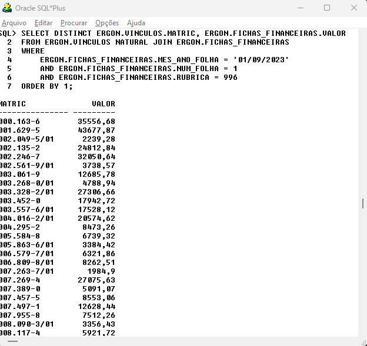

class: center, middle
```{r xaringan-themer, include=FALSE, warning=FALSE}
library(xaringanthemer)
style_mono_accent(
  base_color = "#004b80", 
  header_font_google = google_font("Josefin Sans"),
  text_font_google   = google_font("Montserrat", "300", "300i"),
  code_font_google   = google_font("Fira Mono"),
)
```

```{r xaringan-logo, echo=FALSE}
xaringanExtra::use_logo(
  image_url = "logo.png",
  position = xaringanExtra::css_position(top = "1em", right = "1em"),
  width = "200px"
)

```
# JOIN
---
class: inverse, center, middle

# JUNÇÕES DE TABELAS

---
### JOIN

As junções são utilizadas em instruções **SELECT** para recuperar dados de duas tabelas e “juntá-los” com o objetivo de produzir uma saída combinada. As tabelas envolvidas em uma junção precisam compartilhar dados em comum através de um ou mais atributos. Na maioria
das vezes (embora não necessariamente) estes atributos que “conectam” as tabelas estarão vinculados através de uma ligação Chave Primária-Chave Estrangeira.


---
### JOIN

**Exemplo 1:** Recuperando dados de duas tabelas com **NATURAL JOIN**.  
```{sql eval = F}
SELECT DISTINCT ERGON.VINCULOS.MATRIC, ERGON.FICHAS_FINANCEIRAS.VALOR
FROM ERGON.VINCULOS NATURAL JOIN ERGON.FICHAS_FINANCEIRAS
WHERE 
    ERGON.FICHAS_FINANCEIRAS.MES_ANO_FOLHA = '01/09/2023' 
    AND ERGON.FICHAS_FINANCEIRAS.NUM_FOLHA = 1 
    AND ERGON.FICHAS_FINANCEIRAS.RUBRICA = 996
ORDER BY 1;
```

.pull-left[
<p style='font-size:15px'>
Junções entre tabelas são sempre realizadas aos pares e seguindo ordem especificada na cláusula <strong>FROM</strong>. Internamente, o SGBD realiza a <em>junção natural</em> das tabelas, gerando um resultado intermediário (uma relação temporária na memória de trabalho do SGBD). Neste resultado intermediário, teremos um conjunto contendo todas os registros da tabela <strong style="color:red;">VINCULOS</strong> corretamente “casados” com os registros de <strong style="color:red;">FICHAS_FINANCEIRAS</strong>. Conceitualmente, a operação de junção não descarta nenhum atributo do par de tabelas envolvidas. Por isso, o resultado intermediário contém todos os atributos de
<strong style="color:red;">VINCULOS</strong> e todos os de <strong style="color:red;">FICHAS_FINANCEIRAS</strong> (só uma versão de cada de <strong>NUMFUNC</strong> e <strong>NUMVINC</strong> são mantidos, pois esses atributos são comuns a ambas as tabelas).
</p>
]
.pull-right[
```{r echo=FALSE, out.width="60%", fig.align='center', dpi=600}

```
]

---
### JOIN

**Exemplo 1:** Recuperando dados de duas tabelas com **NATURAL JOIN**.  
```{sql eval = F}
SELECT DISTINCT V.MATRIC, F.VALOR
FROM ERGON.VINCULOS v NATURAL JOIN ERGON.FICHAS_FINANCEIRAS F
WHERE 
    F.MES_ANO_FOLHA = '01/09/2023' 
    AND F.NUM_FOLHA = 1 
    AND F.RUBRICA = 996
ORDER BY 1;
```

O **NATURAL JOIN** é o modo mais simples de juntar tabelas, pois não é necessário explicitar com quais colunas estamos realizando o **JOIN**. O SGBD detecta automaticamente as colunas com mesmo nome nas duas tabelas. 
</br></br>
Para evitar a repetição de nomes longos, podemos podemos criar rótulos para as tabelas. Geralmente, adotamos uma ou duas letras para representar as tabelas. Os rótulos das tabelas podem ser usados em todas as cláusulas da consulta.

---
### JOIN

**Exemplo 2:** Junção interna com **INNER JOIN**. 
```{sql eval = F}
SELECT DISTINCT V.MATRIC, F.VALOR
FROM 
  ERGON.VINCULOS V 
  INNER JOIN ERGON.FICHAS_FINANCEIRAS F
  ON V.NUMFUNC = F.NUMFUNC
  AND V.NUMERO = F.NUMVINC
WHERE 
    F.MES_ANO_FOLHA = '01/09/2023' 
    AND F.NUM_FOLHA = 1 
    AND F.RUBRICA = 996
ORDER BY 1;
```