class: center, middle
```{r xaringan-themer, include=FALSE, warning=FALSE}
library(xaringanthemer)
style_mono_accent(
  base_color = "#004b80", 
  header_font_google = google_font("Josefin Sans"),
  text_font_google   = google_font("Montserrat", "300", "300i"),
  code_font_google   = google_font("Fira Mono"),
  extra_css = list(
  ".small-code .remark-code" = list("font-size" = "70%"),
  ".smaller-code .remark-code" = list("font-size" = "60%")
)
)
```

```{r xaringan-logo, echo=FALSE}
xaringanExtra::use_logo(
  image_url = "logo.png",
  position = xaringanExtra::css_position(top = "1em", right = "1em"),
  width = "200px"
)
```
# OPERAÇÕES DE CONJUNTO
---
## OPERAÇÕES DE CONJUNTO

Operações de conjuntos são operações entre dois ou mais conjuntos de entrada (**SELECT**), ou seja, uma seleção para juntar ou comparar esses conjuntos (tabelas ou campos). Abordaremos a utilização dos operadores de UNIÃO, INTERSEÇÃO e DIFERENÇA na linguagem SQL.

```{r conjuntos1, echo=FALSE, message=F, warning=F,out.width="50%", fig.align='center', dpi=600}
library(ggplot2)
library(patchwork)
library(ggforce)
library(dplyr)
library(latex2exp)

y=seq(-.75,.75, by=.001) 
x=sqrt(.75^2-y^2)
x2=x+1
y2=y+1
x3=-x+2
df=data.frame(x2,y2) |> 
    filter(y2<1+sqrt(.75^2-.5^2) & y2 > 1-sqrt(.75^2-.5^2)) |> 
    rbind(data.frame(x2=x3,y2=y2) |> 
    filter(y2<1+sqrt(.75^2-.5^2) & y2 > 1-sqrt(.75^2-.5^2)))


p1 <- ggplot() +
      geom_circle(aes(x0 = c(1),y0 = c(1), r = rep(.75,1)), size = 2, fill = "darkgreen") +
      geom_circle(aes(x0 = c(1,2),y0 = c(1,1), r = rep(.75,2)), size = 2, n = 1000) +
      geom_text(aes(x = c(.5,2.5), y = rep(.15,2), label = c("A","B")), size = 6) +
      geom_text(aes(x = 0.25, y = 2, label = "U"), size = 6) +
      annotate("text",x = 1.5, y = 2, label = TeX("$A$",bold = T, output="character"),
               size = 8, parse=TRUE, color = "darkred") +
      coord_equal(xlim = c(0,3), ylim = c(0,2.25)) +
      theme_void() + 
      theme(panel.border = element_rect(colour = "black", fill = NA, linewidth = 2),
            panel.background = element_rect(fill = "#fff2d7", size = 0.5, linetype = "solid"),
            plot.margin = unit(c(.25,.25,.25,.25), "cm"))

p2 <- ggplot() +
      geom_circle(aes(x0 = c(1),y0 = c(1), r = rep(.75,1)), size = 2, fill = "#fff2d7") +
      geom_circle(aes(x0 = c(1,2),y0 = c(1,1), r = rep(.75,2)), size = 2, n = 1000) +
      geom_text(aes(x = c(.5,2.5), y = rep(.15,2), label = c("A","B")), size = 6) +
      geom_text(aes(x = 0.25, y = 2, label = "U"), size = 6) +
      annotate("text",x = 1.5, y = 2, label = TeX("$A'$",bold = T, output="character"),
               size = 8, parse=TRUE, color = "darkred") +
      coord_equal(xlim = c(0,3), ylim = c(0,2.25)) +
      theme_void() + 
      theme(panel.border = element_rect(colour = "black", fill = NA, linewidth = 2),
            panel.background = element_rect(fill = "darkgreen", size = 0.5, linetype = "solid"),
            plot.margin = unit(c(.25,.25,.25,.25), "cm"))

p3 <- ggplot() +
      geom_circle(aes(x0 = c(1,2),y0 = c(1,1), r = rep(.75,2)), size = 2, fill = "darkgreen") +
      geom_circle(aes(x0 = c(1,2),y0 = c(1,1), r = rep(.75,2)), size = 2, n = 1000) +
      geom_text(aes(x = c(.5,2.5), y = rep(.15,2), label = c("A","B")), size = 6) +
      geom_text(aes(x = 0.25, y = 2, label = "U"), size = 6) +
      annotate("text",x = 1.5, y = 2, label = TeX("$A\\cup B$",bold = T, output="character"),
               size = 8, parse=TRUE, color = "darkred") +
      coord_equal(xlim = c(0,3), ylim = c(0,2.25)) +
      theme_void() + 
      theme(panel.border = element_rect(colour = "black", fill = NA, linewidth = 2),
            panel.background = element_rect(fill = "#fff2d7", size = 0.5, linetype = "solid"),
            plot.margin = unit(c(.25,.25,.25,.25), "cm"))

p4 <- ggplot() +
      geom_polygon(data = df, aes(x=x2,y=y2), fill = "darkgreen") +
      geom_circle(aes(x0 = c(1,2),y0 = c(1,1), r = rep(.75,2)), size = 2, n = 1000) +
      # geom_point(aes(x= 1.5,  y = 1+sqrt(.75^2-.5^2)), color ="red") +
      geom_text(aes(x = c(.5,2.5), y = rep(.15,2), label = c("A","B")), size = 6) +
      # geom_text(aes(x = 0.25, y = 2, label = "u"), size = 10) +
      geom_text(aes(x = 0.25, y = 2, label = "U"), size = 6) +
      annotate("text",x = 1.5, y = 2, label = TeX("$A\\cap B$",bold = T, output="character"), 
               size = 8, parse=TRUE, color = "darkred") +
      coord_equal(xlim = c(0,3), ylim = c(0,2.25)) +
      theme_void() + 
      theme(panel.border = element_rect(colour = "black", fill = NA, linewidth = 2),
            panel.background = element_rect(fill = "#fff2d7", size = 0.5, linetype = "solid"),
            plot.margin = unit(c(.25,.25,.25,.25), "cm"))

p5 <- ggplot() +
      geom_circle(aes(x0 = c(1),y0 = c(1), r = rep(.75,1)), size = 2, fill = "darkgreen") +
      geom_circle(aes(x0 = c(2),y0 = c(1), r = rep(.75,1)), size = 2, fill = "#fff2d7") +
      geom_circle(aes(x0 = c(1,2),y0 = c(1,1), r = rep(.75,2)), size = 2, n = 1000) +
      geom_text(aes(x = c(.5,2.5), y = rep(.15,2), label = c("A","B")), size = 6) +
      geom_text(aes(x = 0.25, y = 2, label = "U"), size = 6) +
      annotate("text",x = 1.5, y = 2, label = TeX("$A - B$",bold = T, output="character"),
               size = 8, parse=TRUE, color = "darkred") +
      coord_equal(xlim = c(0,3), ylim = c(0,2.25)) +
      theme_void() + 
      theme(panel.border = element_rect(colour = "black", fill = NA, linewidth = 2),
            panel.background = element_rect(fill = "#fff2d7", size = 0.5, linetype = "solid"),
            plot.margin = unit(c(.25,.25,.25,.25), "cm"))

p6 <- ggplot() +
      geom_circle(aes(x0 = c(1,2),y0 = c(1,1), r = rep(.75,2)), size = 2, fill = "darkgreen") +
      geom_polygon(data = df, aes(x=x2,y=y2), fill = "#fff2d7") +
      geom_circle(aes(x0 = c(1,2),y0 = c(1,1), r = rep(.75,2)), size = 2, n = 1000) +
      geom_text(aes(x = c(.5,2.5), y = rep(.15,2), label = c("A","B")), size = 6) +
      geom_text(aes(x = 0.25, y = 2, label = "U"), size = 6) +
      annotate("text",x = 1.5, y = 2, label = TeX("$A\\cup B - A\\cap B$",bold = T, output="character"),
               size = 4, parse=TRUE, color = "darkred") +
      coord_equal(xlim = c(0,3), ylim = c(0,2.25)) +
      theme_void() + 
      theme(panel.border = element_rect(colour = "black", fill = NA, linewidth = 2),
            panel.background = element_rect(fill = "#fff2d7", size = 0.5, linetype = "solid"),
            plot.margin = unit(c(.25,.25,.25,.25), "cm"))


p1+p2+p3+p4+p5+p6+plot_layout(ncol = 3, guides = 'collect',)
```

---
### OPERAÇÕES DE CONJUNTO

**Exemplo 1:** Operador **UNION**.
.pull-left[
```{sql eval = F}
SELECT 
  NUMFUNC, RUBRICA, VALOR
FROM 
  ERGON.FICHAS_FINANCEIRAS
WHERE 
  MES_ANO_FOLHA = '01/09/2023'
  AND NUM_FOLHA = 1
  AND EMP_CODIGO = 1
UNION
SELECT 
  NUMFUNC, RUBRICA, VALOR
FROM 
  ERGON.CONS
WHERE 
  DTINI = '01/09/2023'
  AND EMP_CODIGO = 1
ORDER BY 1;
```
]
.pull-right[
O operador **UNION** combina o resultado de duas ou mais consultas em um resultado único, retornando todas as linhas pertencentes a todas as consultas envolvidas na execução. Para utilizar o **UNION**, é necessário que a quantidade de colunas e suas ordens sejam identicas e que os tipos de dados sejam compatíveis. 
]
---
### OPERAÇÕES DE CONJUNTO
**Exemplo 1:** Operador **UNION**.
.pull-left[
Conforme podemos observar no ***Exemplo 1***, podemos utilizar cláusulas **WHERE** e **ORDER BY** em consultas que contém o operador **UNION**. Para isso, a cláusula **WHERE** deve ser utilizada em cada consulta e a cláusula **ORDER BY**, apenas uma vez, como última linha do comando. Não é necessário que as colunas das consultas utilizadas tenham o mesmo nome, apenas que tenham o mesmo tipo. O SGBD utiliza o nome das colunas da última consulta.
É possível utilizar o operador **UNION** diversas vezes em uma mesma consulta. 
```{r conjuntos, echo=FALSE, message=F, warning=F,out.width="50%", fig.align='center', dpi=600}
library(ggplot2)
library(patchwork)
library(ggforce)
library(dplyr)
library(latex2exp)

y=seq(-.75,.75, by=.001) 
x=sqrt(.75^2-y^2)
x2=x+1
y2=y+1
x3=-x+2
df=data.frame(x2,y2) |> 
    filter(y2<1+sqrt(.75^2-.5^2) & y2 > 1-sqrt(.75^2-.5^2)) |> 
    rbind(data.frame(x2=x3,y2=y2) |> 
    filter(y2<1+sqrt(.75^2-.5^2) & y2 > 1-sqrt(.75^2-.5^2)))

p3 <- ggplot() +
      geom_circle(aes(x0 = c(1,2),y0 = c(1,1), r = rep(.75,2)), size = 2, fill = "darkgreen") +
      geom_circle(aes(x0 = c(1,2),y0 = c(1,1), r = rep(.75,2)), size = 2, n = 1000) +
      geom_text(aes(x = c(.5,2.5), y = rep(.15,2), label = c("A","B")), size = 6) +
      geom_text(aes(x = 0.25, y = 2, label = "U"), size = 6) +
      annotate("text",x = 1.5, y = 2, label = TeX("$A\\cup B$",bold = T, output="character"),
               size = 8, parse=TRUE, color = "darkred") +
      coord_equal(xlim = c(0,3), ylim = c(0,2.25)) +
      theme_void() + 
      theme(panel.border = element_rect(colour = "black", fill = NA, linewidth = 2),
            panel.background = element_rect(fill = "#fff2d7", size = 0.5, linetype = "solid"),
            plot.margin = unit(c(.25,.25,.25,.25), "cm"))

p3
```


]

.pull-right[
```{r echo=FALSE, out.width="80%", fig.align='center', dpi=600}
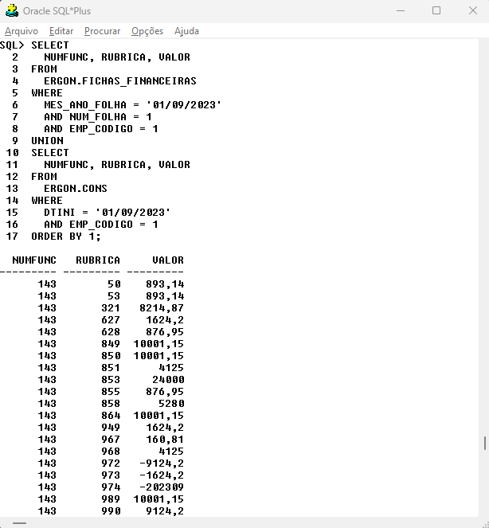
```
]
---
### OPERAÇÕES DE CONJUNTO
**Exemplo 2:** Operador **UNION ALL**.
.pull-left[
```{sql eval = F}
SELECT 
  NUMFUNC, RUBRICA, VALOR
FROM 
  ERGON.FICHAS_FINANCEIRAS
WHERE 
  MES_ANO_FOLHA = '01/09/2023'
  AND NUMFUNC = 2936895
  AND RUBRICA = 904
UNION ALL
SELECT 
  NUMFUNC, RUBRICA, VALOR
FROM 
  ERGON.CONS
WHERE 
  DTINI = '01/09/2023'
  AND NUMFUNC = 2936895
  AND RUBRICA = 904
ORDER BY 1;
```
]
.pull-right[
Por padrão o operador **UNION** remove linhas duplicadas. Se queremos que o resultado exiba todos os registros de todas as consultas usadas, devemos usar o operador **UNION ALL**.
]
---
### OPERAÇÕES DE CONJUNTO
**Exemplo 2:** Operador **UNION ALL**.
.pull-left[
```{r echo=FALSE, out.width="70%", fig.align='center', dpi=600, fig.cap='Usando UNION ALL'}
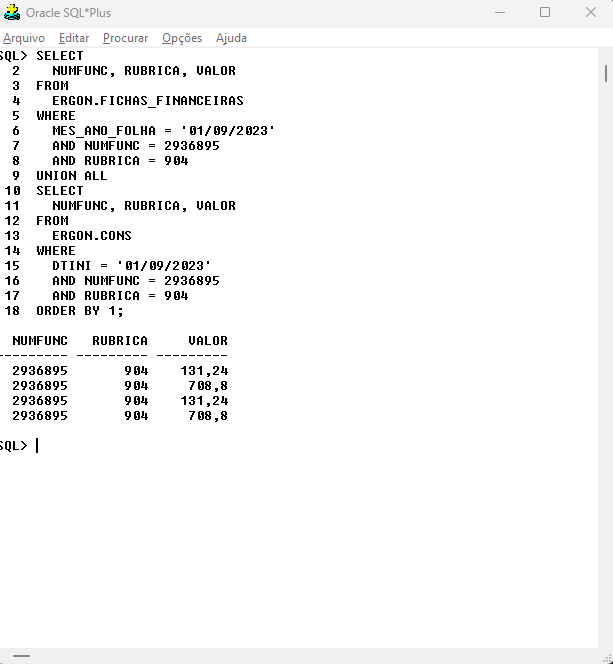
```
]

.pull-right[
```{r echo=FALSE, out.width="70%", fig.align='center', dpi=600, fig.cap='Usando UNION'}
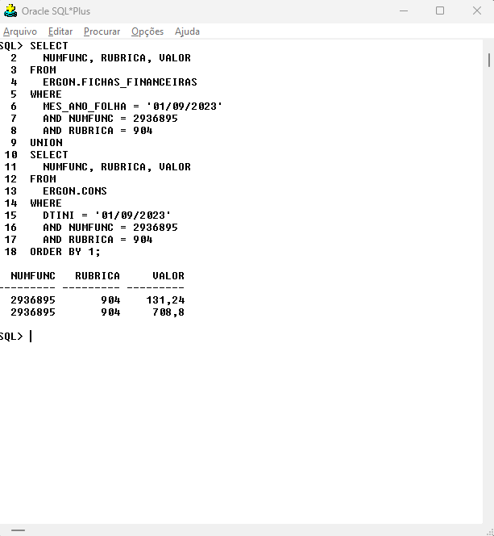
```
]
---
### OPERAÇÕES DE CONJUNTO
**Exemplo 3:** Operador **INTERSECT**.
.pull-left[
```{sql eval = F}
SELECT 
  NUMFUNC, RUBRICA, VALOR
FROM 
  ERGON.FICHAS_FINANCEIRAS
WHERE 
  MES_ANO_FOLHA = '01/09/2023'
  AND NUM_FOLHA = 1
  AND EMP_CODIGO = 1
INTERSECT 
SELECT 
  NUMFUNC, RUBRICA, VALOR
FROM 
  ERGON.CONS
WHERE 
  DTINI = '01/09/2023'
  AND EMP_CODIGO = 1
ORDER BY 1;
```
]
.pull-right[
O operador **INTERSECT** retorna a interseção de dois ou mais conjuntos de resultados. Assim como na união, cada conjunto de resultados é definido por um comando **SELECT**. Se um registro existe em ambos os conjuntos ele será incluído no resultado final.
]

---
### OPERAÇÕES DE CONJUNTO
**Exemplo 3:** Operador **INTERSECT**.
.pull-left[
O uso do operador **INTERSECT** é similar ao uso do operador **UNION**. Logo, as colunas selecionadas nas consultas devem ser do mesmo tipo. Também devemos usar cláusulas **WHERE** separadas para cada consulta e uma única cláusula **ORDER BY**. 

```{r conjuntos2, echo=FALSE, message=F, warning=F,out.width="50%", fig.align='center', dpi=600}
library(ggplot2)
library(patchwork)
library(ggforce)
library(dplyr)
library(latex2exp)

y=seq(-.75,.75, by=.001) 
x=sqrt(.75^2-y^2)
x2=x+1
y2=y+1
x3=-x+2
df=data.frame(x2,y2) |> 
    filter(y2<1+sqrt(.75^2-.5^2) & y2 > 1-sqrt(.75^2-.5^2)) |> 
    rbind(data.frame(x2=x3,y2=y2) |> 
    filter(y2<1+sqrt(.75^2-.5^2) & y2 > 1-sqrt(.75^2-.5^2)))

p4 <- ggplot() +
      geom_polygon(data = df, aes(x=x2,y=y2), fill = "darkgreen") +
      geom_circle(aes(x0 = c(1,2),y0 = c(1,1), r = rep(.75,2)), size = 2, n = 1000) +
      # geom_point(aes(x= 1.5,  y = 1+sqrt(.75^2-.5^2)), color ="red") +
      geom_text(aes(x = c(.5,2.5), y = rep(.15,2), label = c("A","B")), size = 6) +
      # geom_text(aes(x = 0.25, y = 2, label = "u"), size = 10) +
      geom_text(aes(x = 0.25, y = 2, label = "U"), size = 6) +
      annotate("text",x = 1.5, y = 2, label = TeX("$A\\cap B$",bold = T, output="character"), 
               size = 8, parse=TRUE, color = "darkred") +
      coord_equal(xlim = c(0,3), ylim = c(0,2.25)) +
      theme_void() + 
      theme(panel.border = element_rect(colour = "black", fill = NA, linewidth = 2),
            panel.background = element_rect(fill = "#fff2d7", size = 0.5, linetype = "solid"),
            plot.margin = unit(c(.25,.25,.25,.25), "cm"))

p4
```
]

.pull-right[
```{r echo=FALSE, out.width="80%", fig.align='center', dpi=600}
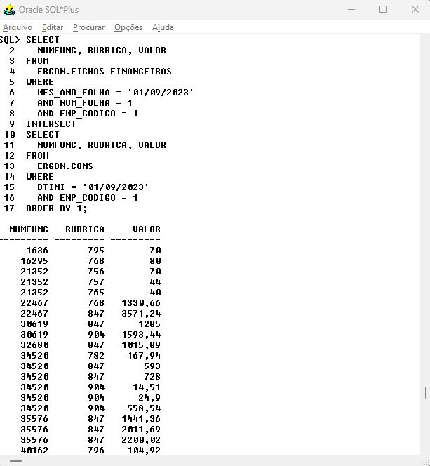
```
]

---
### OPERAÇÕES DE CONJUNTO
**Exemplo 4:** Operador **MINUS**.
.pull-left[
```{sql eval = F}
SELECT 
  NUMFUNC, RUBRICA, VALOR
FROM 
  ERGON.FICHAS_FINANCEIRAS
WHERE 
  MES_ANO_FOLHA = '01/09/2023'
  AND NUM_FOLHA = 1
  AND EMP_CODIGO = 1
MINUS
SELECT 
  NUMFUNC, RUBRICA, VALOR
FROM 
  ERGON.CONS
WHERE 
  DTINI = '01/09/2023'
  AND EMP_CODIGO = 1
ORDER BY 1;
```
]
.pull-right[
O operador **MINUS** é utilizado para retornar todas as linhas do primeiro conjunto de resultados (definido pelo primeiro **SELECT**) e então remover deste resultado todas as linhas do segundo conjunto de resultados (definido pelo segundo **SELECT**). Em alguns SGBDs, o operador é chamado de **EXCEPT**. 
]
---
### OPERAÇÕES DE CONJUNTO
**Exemplo 4:** Operador **MINUS**.
.pull-left[
O operador **MINUS** não é comutativo. Uma operação *A MINUS B* tem um resultado diferente de uma operação *B MINUS A*.

```{r conjuntos3, echo=FALSE, message=F, warning=F,out.width="50%", fig.align='center', dpi=600}
library(ggplot2)
library(patchwork)
library(ggforce)
library(dplyr)
library(latex2exp)

y=seq(-.75,.75, by=.001) 
x=sqrt(.75^2-y^2)
x2=x+1
y2=y+1
x3=-x+2
df=data.frame(x2,y2) |> 
    filter(y2<1+sqrt(.75^2-.5^2) & y2 > 1-sqrt(.75^2-.5^2)) |> 
    rbind(data.frame(x2=x3,y2=y2) |> 
    filter(y2<1+sqrt(.75^2-.5^2) & y2 > 1-sqrt(.75^2-.5^2)))

p5 <- ggplot() +
      geom_circle(aes(x0 = c(1),y0 = c(1), r = rep(.75,1)), size = 2, fill = "darkgreen") +
      geom_circle(aes(x0 = c(2),y0 = c(1), r = rep(.75,1)), size = 2, fill = "#fff2d7") +
      geom_circle(aes(x0 = c(1,2),y0 = c(1,1), r = rep(.75,2)), size = 2, n = 1000) +
      geom_text(aes(x = c(.5,2.5), y = rep(.15,2), label = c("A","B")), size = 6) +
      geom_text(aes(x = 0.25, y = 2, label = "U"), size = 6) +
      annotate("text",x = 1.5, y = 2, label = TeX("$A - B$",bold = T, output="character"),
               size = 8, parse=TRUE, color = "darkred") +
      coord_equal(xlim = c(0,3), ylim = c(0,2.25)) +
      theme_void() + 
      theme(panel.border = element_rect(colour = "black", fill = NA, linewidth = 2),
            panel.background = element_rect(fill = "#fff2d7", size = 0.5, linetype = "solid"),
            plot.margin = unit(c(.25,.25,.25,.25), "cm"))

p5
```

]
.pull-right[
```{r echo=FALSE, out.width="80%", fig.align='center', dpi=600}

```
]
---
```{r xaringan-editable, echo=FALSE}
xaringanExtra::use_editable()
```

### Exercícios

1. A consulta a seguir retorna todos os valores por matrícula da rubrica 999 da folha 1 de setembro de 2023. Adicione uma consulta que retorne os valores da rubrica 996 do mesmo mês usando o operador **UNION**. Organize o resultado final por matrículas.

.can-edit[
.smaller-code[
```{sql eval = F}
-- FORMA EXPLICITA
SELECT DISTINCT
    V.MATRIC
    , F.RUBRICA
    , F.VALOR
FROM 
    ERGON.VINCULOS V
    JOIN ERGON.FICHAS_FINANCEIRAS F
    ON V.NUMFUNC = F.NUMFUNC
    AND V.NUMERO = F.NUMVINC
WHERE
    F.MES_ANO_FOLHA = '01/09/2023'
    AND F.NUM_FOLHA = 1
    AND F.RUBRICA = 999;
```
]
]
---
```{r xaringan-editable0, echo=FALSE}
xaringanExtra::use_editable()
```

### Exercícios

1. A consulta a seguir retorna todos os valores por matrícula da rubrica 999 da folha 1 de setembro de 2023. Adicione uma consulta que retorne os valores da rubrica 996 do mesmo mês usando o operador **UNION**. Organize o resultado final por matrículas.

.can-edit[
.smaller-code[
```{sql eval = F}
-- FORMA IMPLICITA 
SELECT DISTINCT
    V.MATRIC
    , F.RUBRICA
    , F.VALOR
FROM 
    ERGON.VINCULOS V
    , ERGON.FICHAS_FINANCEIRAS F
WHERE
    V.NUMFUNC = F.NUMFUNC
    AND V.NUMERO = F.NUMVINC
    AND F.MES_ANO_FOLHA = '01/09/2023'
    AND F.NUM_FOLHA = 1
    AND F.RUBRICA = 999;
```
]
]

---
```{r xaringan-editable2, echo=FALSE}
xaringanExtra::use_editable()
```

### Exercícios
<ol start="2">
<li> A consulta abaixo retorna o nome, a matricula e o cargo de professores com matrículas ativas lotados no CIEP Procópio Ferreira (SETOR = 11859). Adicione uma consulta para remover os registros dos Professores Adjuntos de Educação Infantil usando o operador **MINUS**.
</ol>
.can-edit[
.smaller-code[
```{sql eval = F}
-- FORMA EXPLICITA
COL NOME FOR A50 
SELECT DISTINCT
  V.MATRIC
  , F.NOME
  , C.NOME CARGO
FROM 
  ERGON.VINCULOS V
  JOIN ERGON.FUNCIONARIOS F
  ON V.NUMFUNC = F.NUMERO
  JOIN ERGON.PROVIMENTOS_EV P
  ON V.NUMFUNC = P.NUMFUNC
  AND V.NUMERO = P.NUMVINC
  JOIN ERGON.CARGOS_ C
  ON P.CARGO = C.CARGO
WHERE
  V.DTVAC IS NULL -- REMOVE MATRÍCULAS COM DATA DE VACÂNCIA
  AND P.SETOR = '11859' -- CAMPO COM CÓDIGO DO SETOR
  AND C.NOME LIKE 'PROF%'; 
```
]
]
---
```{r xaringan-editable3, echo=FALSE}
xaringanExtra::use_editable()
```

### Exercícios
<ol start="2">
<li> A consulta abaixo retorna o nome, a matricula e o cargo de professores com matrículas ativas lotados no CIEP Procópio Ferreira (SETOR = 11859). Adicione uma consulta para remover os registros dos Professores Adjuntos de Educação Infantil usando o operador **MINUS**.
</ol>
.can-edit[
.smaller-code[
```{sql eval = F}
-- FORMA IMPLÍCITA
COL NOME FOR A50 
SELECT DISTINCT
  V.MATRIC
  , F.NOME
  , C.NOME CARGO
FROM 
  ERGON.VINCULOS V
  , ERGON.FUNCIONARIOS F
  , ERGON.PROVIMENTOS_EV P
  , ERGON.CARGOS_ C
WHERE
  V.NUMFUNC = F.NUMERO
  AND V.NUMFUNC = P.NUMERO
  AND V.NUMERO = P.NUMVINC
  AND P.CARGO = C.CARGO
  AND V.DTVAC IS NULL -- REMOVE MATRÍCULAS COM DATA DE VACÂNCIA
  AND P.SETOR = '11859' -- CAMPO COM CÓDIGO DO SETOR
  AND C.NOME LIKE 'PROF%';
```
]
]
---
### OPERAÇÕES DE CONJUNTO
**Exemplo 5:** Colunas com valores fixos.
.pull-left[
.small-code[
```{sql eval = F}
SELECT 
  RUBRICA
  , SUM(VALOR) VALOR_MES_ATUAL
  , 0 VALOR_MES_ANTERIOR
FROM 
  ERGON.FICHAS_FINANCEIRAS
WHERE 
  MES_ANO_FOLHA = '01/10/2023'
  AND RUBRICA = 1
  AND EMP_CODIGO = 1
GROUP BY RUBRICA
UNION
SELECT 
  RUBRICA
  , 0 VALOR_MES_ATUAL
  , SUM(VALOR) VALOR_MES_ANTERIOR
FROM 
  ERGON.FICHAS_FINANCEIRAS
WHERE 
  MES_ANO_FOLHA = '01/09/2023'
  AND RUBRICA = 1
  AND EMP_CODIGO = 1
GROUP BY RUBRICA;
```
]
]
.pull-right[
```{r echo=FALSE, out.width="80%", fig.align='center', dpi=600}
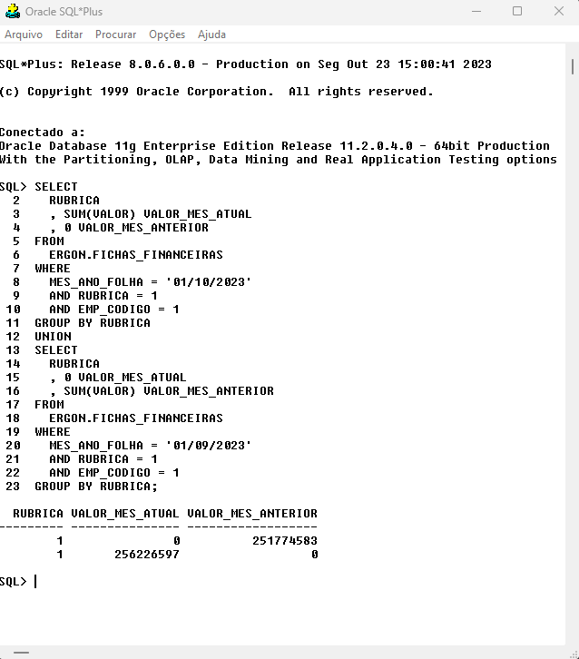
```
]
---
class: center, middle

# SUBCONSULTAS

---
### SUBCONSULTAS

Uma subconsulta (subquery) consiste em um comando **SELECT** que existe dentro de um outro comando SQL. O comando externo é chamado de comando “pai” da subconsulta.
O uso mais comum para as subconsultas é dentro de outra instrução **SELECT**, com o objetivo de retornar resultados que, de alguma forma, serão utilizados pela consulta pai. No entanto, as subqueries também são aceitas em comandos **INSERT**, **UPDATE**, **DELETE** e no **CREATE TABLE**. No uso de subconsultas na cláusula **SELECT**, o chamado *“SELECT dentro de SELECT”*, as subconsultas podem ser de diferentes tipos:

<ul style="font-size:18px">
<li> <strong>Subconsulta de única linha (single-row):</strong> retornará sempre uma única linha em seu resultado (independente do número de colunas).
<li> <strong>Subconsulta de múltiplas linhas (multiple-row):</strong> pode retornar zero, uma ou mais linhas em seu resultado (independente do número de colunas). Não é garantido que muitas linhas serão retornadas, mas como isto pode acontecer, a consulta pai deverá estar estruturada para receber muitas linhas. 
<li> <strong>Subconsulta de única coluna (single-column):</strong> retornará sempre uma única coluna no resultado (independente do número de linhas).
<li> <strong>Subconsulta de múltiplas colunas (multiple-column):</strong> pode retornar uma ou mais colunas em seu resultado (independente do número de linhas).
<li> <strong>Subconsulta escalar:</strong> retornará sempre um resultado contendo uma linha e uma única coluna (ou seja, um único valor). Desta forma, uma subconsulta escalar corresponde a uma subconsulta single-row, single-column.
<li> <strong>Subconsulta correlacionada (correlated subquery):</strong> este tipo de subconsulta contém uma referência para uma ou mais colunas da tabela pai dentro de sua própria definição. Normalmente, uma condição especificada no <strong>WHERE</strong> da subconsulta envolverá a comparação de uma coluna da consulta pai com uma coluna da subconsulta, permitindo assim, a efetivação de associações entre uma linha da
tabela pai com uma linha gerada pela subconsulta. 
</ul>

---
### SUBCONSULTAS

**Exemplo 1:** Subconsultas escalares na cláusula **WHERE**.
</br></br>
Suponha que queiramos obter uma lista de servidores que tiveram um salário bruto maior do que a média salarial da prefeitura em um determinado mês. Para isso, poderíamos realizar duas consultas separadas para chegar ao resultado procurado.

```{sql eval = F}
-- Consulta 1: retorna a média salarial
SELECT 
  AVG(F.VALOR) MEDIA
FROM 
  ERGON.VINCULOS V
  JOIN ERGON.FICHAS_FINANCEIRAS F
  ON V.NUMFUNC = F.NUMFUNC
  AND V.NUMERO = F.NUMVINC
WHERE
  V.EMP_CODIGO = 1
  AND F.MES_ANO_FOLHA = '01/09/2023'
  AND F.RUBRICA = 996; 
```

---
### SUBCONSULTAS

**Exemplo 1:** Subconsultas escalares na cláusula **WHERE**.
</br></br>
Suponha que queiramos obter uma lista de servidores que tiveram um salário bruto maior do que a média salarial da prefeitura em um determinado mês. Para isso, poderíamos realizar duas consultas separadas para chegar ao resultado procurado.

```{sql eval = F}
-- Consulta 2: retorna os servidores com salário bruto maior do que a média salarial
SELECT 
  V.MATRIC
  , F.VALOR
FROM 
  ERGON.VINCULOS V
  JOIN ERGON.FICHAS_FINANCEIRAS F
  ON V.NUMFUNC = F.NUMFUNC
  AND V.NUMERO = F.NUMVINC
WHERE
  V.EMP_CODIGO = 1
  AND F.MES_ANO_FOLHA = '01/09/2023'
  AND F.RUBRICA = 996
  AND F.VALOR > 6874.67
ORDER BY 2; 
```

---
### SUBCONSULTAS

**Exemplo 1:** Subconsultas escalares na cláusula **WHERE**.
</br></br>
Logo, a primeira consulta retornou o valor da média salarial da prefeitura em setembro, que foi de 6874,67, um valor escalar. Em seguida, elaboramos um segundo **SELECT** onde esse valor escalar foi utilizado na cláusula **WHERE**, mais especificamente na condição F.VALOR > 6874.67. 
</br>
Entretanto, a linguagem SQL nos permite combinar esses dois **SELECTs** em um único comando, bastando para isso transformar o primeiro **SELECT** em uma subconsulta que retornará um valor escalar para o primeiro **SELECT**.

---
### SUBCONSULTAS

**Exemplo 1:** Subconsultas escalares na cláusula **WHERE**.
.pull-left[
.small-code[
```{sql eval = F}
SELECT 
  V.MATRIC 
  , F.VALOR
FROM 
  ERGON.VINCULOS V
  JOIN ERGON.FICHAS_FINANCEIRAS F
  ON V.NUMFUNC = F.NUMFUNC
  AND V.NUMERO = F.NUMVINC
WHERE
  V.EMP_CODIGO = 1
  AND F.MES_ANO_FOLHA = '01/09/2023'
  AND F.RUBRICA = 996
  AND F.VALOR > (
    SELECT #<<
      AVG(F.VALOR) MEDIA #<<
    FROM #<<
      ERGON.VINCULOS V #<<
      JOIN ERGON.FICHAS_FINANCEIRAS F #<<
      ON V.NUMFUNC = F.NUMFUNC #<<
      AND V.NUMERO = F.NUMVINC #<<
    WHERE #<<
      V.EMP_CODIGO = 1 #<<
      AND F.MES_ANO_FOLHA = '01/09/2023' #<<
      AND F.RUBRICA = 996 #<<
  )
ORDER BY 2; 
```
]
]

.pull-right[
```{r echo=FALSE, out.width="80%", fig.align='center', dpi=600}
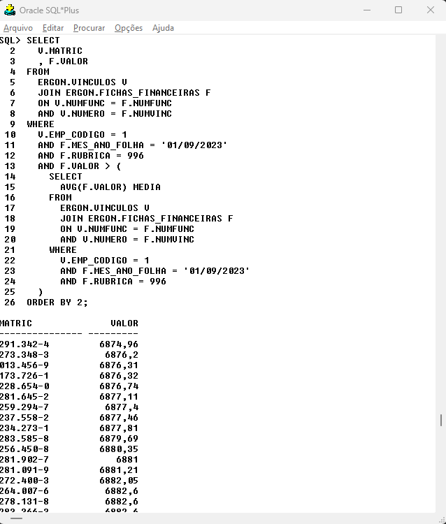
```
]


---
### SUBCONSULTAS

**Exemplo 1:** Subconsultas escalares na cláusula **WHERE**.
</br></br>
A consulta interna (subconsulta) é executada primeiro pelo SGBD (por isso mesmo, ela é está especificada entre parênteses). O resultado de sua execução corresponde a uma relação contendo uma linha e uma coluna (valor escalar), que armazena o valor
médio. Tendo sido determinado, este valor médio é então utilizado no **WHERE** da consulta externa. 
</br></br>
O valor retornado pela subconsulta foi utilizado em um teste do tipo “maior que” (operador **“ > ”**). Este tipo de teste pode ser utilizado apenas para avaliar um valor escalar. Caso a subquery não fosse do tipo escalar (retornasse mais de uma linha ou
mais de uma coluna), o teste com **“ > ”** ficaria sem sentido e ocorreria um erro de execução do comando SQL. Apenas as subqueries do tipo escalar podem ser utilizadas em testes que envolvam os operadores **=, <>, <, >, >= e <=**. 
</br></br>
As subconsultas podem ser utilizadas normalmente em qualquer tipo de **SELECT**, incluindo os que possuem **JOIN**, **GROUP BY** e funções de grupo.

---
### SUBCONSULTAS

**Exemplo 2:** Subconsultas escalares na cláusula **WHERE**.
.pull-left[
.small-code[
```{sql eval = F}
-- Maior salário bruto em setembro
SELECT 
  V.MATRIC , F.VALOR
FROM 
  ERGON.VINCULOS V
  JOIN ERGON.FICHAS_FINANCEIRAS F
  ON V.NUMFUNC = F.NUMFUNC
  AND V.NUMERO = F.NUMVINC
WHERE
  V.EMP_CODIGO = 1
  AND F.MES_ANO_FOLHA = '01/09/2023'
  AND F.RUBRICA = 996
  AND F.VALOR = (
    SELECT MAX(F.VALOR) MAXIMO #<<
    FROM ERGON.VINCULOS V JOIN ERGON.FICHAS_FINANCEIRAS F #<<
      ON V.NUMFUNC = F.NUMFUNC #<<
      AND V.NUMERO = F.NUMVINC #<<
    WHERE #<<
      V.EMP_CODIGO = 1 #<<
      AND F.MES_ANO_FOLHA = '01/09/2023' #<< 
      AND F.RUBRICA = 996) #<<
ORDER BY 2; 
```
]
]
.pull-right[
```{r echo=FALSE, out.width="80%", fig.align='center', dpi=600}
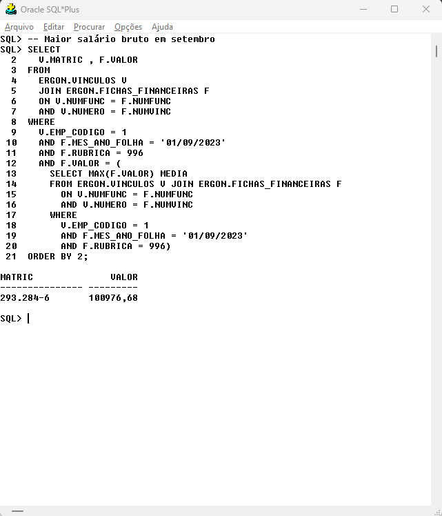
```
]

---
### SUBCONSULTAS
**Exemplo 3:** Subconsultas multi-row na Cláusula **WHERE**.
.pull-left[
.small-code[
```{sql eval = F}
SELECT DISTINCT
  F.RUBRICA
  , R.NOME
  , F.VALOR
FROM 
  ERGON.VINCULOS V
  JOIN ERGON.FICHAS_FINANCEIRAS F
  ON V.NUMFUNC = F.NUMFUNC
  AND V.NUMERO = F.NUMVINC
  JOIN ERGON.RUBRICAS R
  ON R.RUBRICA = F.RUBRICA
WHERE
  F.MES_ANO_FOLHA = '01/09/2023'
  AND F.NUM_FOLHA = 1
  AND V.MATRIC = '160.805-8'
  AND F.RUBRICA IN (
    SELECT DISTINCT  #<<
      RUBRICA  #<<
    FROM  #<<
      ERGON.FATORES_RUBRICA_GERAL  #<<
    WHERE #<<
      FATOR = 'BASE IR'  #<<
      AND DTFIM IS NULL  #<<
  )
ORDER BY 2; 
```
]
]
.pull-right[

Uma subconsulta multi-row é aquela que retorna mais de uma linha. O operador **IN** é um dos poucos operadores que podem ser utilizados com este tipo de subconsulta na cláusula **WHERE**, pois ele é aplicado sobre listas de valores. 
</br></br>
No *Exemplo 3*, a subconsulta destacada retorna a lista de rubricas do fator <strong style="color:red;">'BASE IR'</strong>. Depois, esses valores são usados para restringir os registros da consulta externa.
</br></br>
Além do **IN**, também é possível utilizar os operadores **ANY**, **SOME** e **ALL** para lidar com subconsultas multi-row no **WHERE**.
]
---
### SUBCONSULTAS
**Exemplo 3:** Subconsultas multi-row na Cláusula **WHERE**.
.pull-left[
.small-code[
```{sql eval = F}
SELECT DISTINCT
  F.RUBRICA
  , R.NOME
  , F.VALOR
FROM 
  ERGON.VINCULOS V
  JOIN ERGON.FICHAS_FINANCEIRAS F
  ON V.NUMFUNC = F.NUMFUNC
  AND V.NUMERO = F.NUMVINC
  JOIN ERGON.RUBRICAS R
  ON R.RUBRICA = F.RUBRICA
WHERE
  F.MES_ANO_FOLHA = '01/09/2023'
  AND F.NUM_FOLHA = 1
  AND V.MATRIC = '160.805-8'
  AND F.RUBRICA IN (
    SELECT DISTINCT  #<<
      RUBRICA  #<<
    FROM  #<<
      ERGON.FATORES_RUBRICA_GERAL  #<<
    WHERE #<<
      FATOR = 'BASE IR'  #<<
      AND DTFIM IS NULL  #<<
  )
ORDER BY 2; 
```
]
]
.pull-right[
```{r echo=FALSE, out.width="80%", fig.align='center', dpi=600}
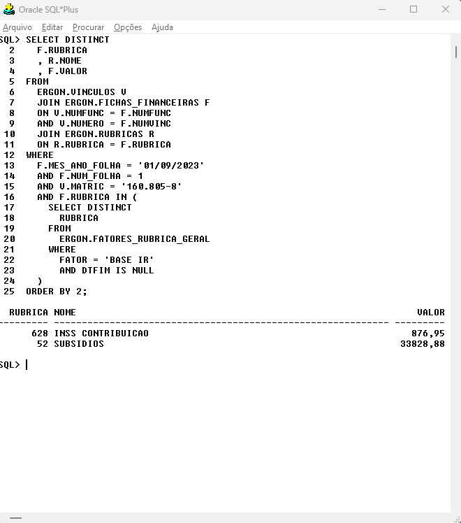
```
]


---
### OPERADORES ANY, SOME E ALL

Os operadores **ANY**, **SOME** e **ALL** são usados para comparar um valor a uma lista ou subconsulta. Devem ser usados em conjunto com os operadores de comparação **=, <>, >, <, <= e >= **.

.pull-left[
* **ANY:** Retorna *TRUE* se <strong style="color:red;">qualquer uma</strong> das condições é verdadeira.

```{sql eval = F}
--USANDO ANY
SELECT DISTINCT RUBRICA
FROM ERGON.RUBRICAS
WHERE RUBRICA = ANY(1,10,1000)
ORDER BY 1;

--USANDO OR
SELECT DISTINCT RUBRICA
FROM ERGON.RUBRICAS
WHERE 
  RUBRICA = 1 
  OR RUBRICA = 10
  OR RUBRICA = 1000
ORDER BY 1;
```

* **SOME:** Funcionamento identico ao **ANY**.
]
.pull-right[
```{r echo=FALSE, out.width="70%", fig.align='center', dpi=600}
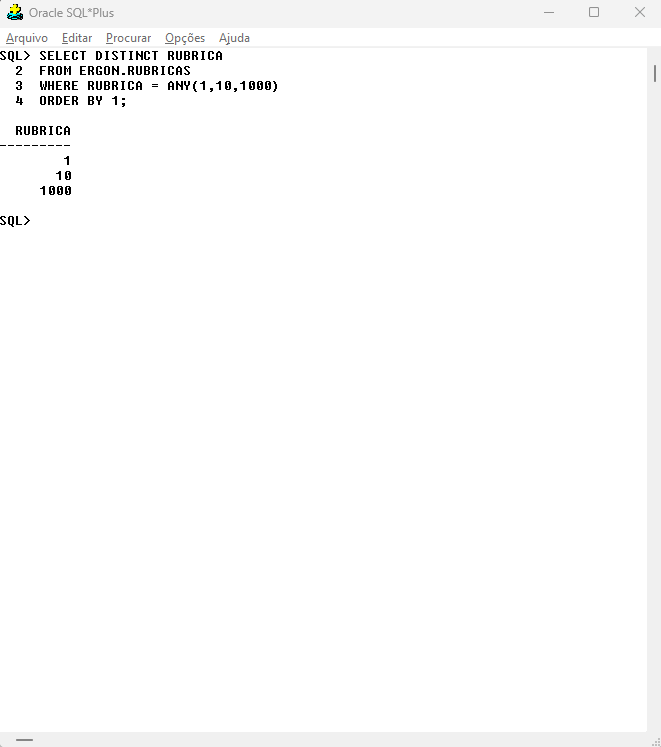
```
]
---
### OPERADORES ANY, SOME E ALL

Os operadores **ANY**, **SOME** e **ALL** são usados para comparar um valor a uma lista ou subconsulta. Devem ser usados em conjunto com os operadores de comparação **=, <>, >, <, <= e >= **.
.pull-left[
* **ALL:** Retorna *TRUE* se <strong style="color:red;">todas</strong> as condições são verdadeiras.
```{sql eval = F}
--USANDO ALL
SELECT DISTINCT RUBRICA
FROM ERGON.RUBRICAS
WHERE RUBRICA > ALL(1,10,1000)
ORDER BY 1;

--USANDO AND
SELECT DISTINCT RUBRICA
FROM ERGON.RUBRICAS
WHERE 
  RUBRICA > 1 
  AND RUBRICA > 10 
  AND RUBRICA > 1000
ORDER BY 1;
```
]
.pull-right[
```{r echo=FALSE, out.width="70%", fig.align='center', dpi=600}
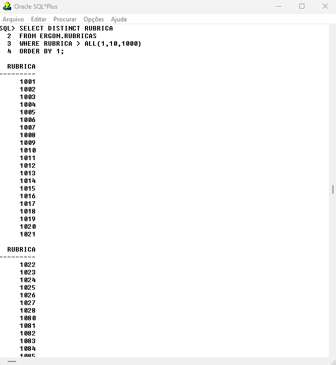
```
]
---
### SUBCONSULTAS
**Exemplo 4:** Subconsultas na Cláusula **FROM**.
.pull-left[
.smaller-code[
```{sql eval = F}
SELECT DISTINCT
  V.MATRIC
  , F.VALOR
  , A.VALOR BASE_IR
  , A.VALOR2 ACERTO_IR
FROM
  ERGON.VINCULOS V
  JOIN ERGON.FICHAS_FINANCEIRAS F
  ON V.NUMFUNC = F.NUMFUNC
  AND V.NUMERO = F.NUMVINC
  LEFT JOIN ( #<<
    SELECT DISTINCT #<<
      NUMFUNC  #<<
      , NUMVINC #<<
      , VALOR #<<
      , VALOR2 #<<
    FROM  #<<
      ERGON.VANTAGENS  #<<
    WHERE  #<<
      VANTAGEM = 'ACERTO IR' #<<
      AND DTINI = '01/09/2023' #<<
      AND DTFIM = '30/09/2023' #<<
  ) A #<<
  ON A.NUMFUNC = V.NUMFUNC 
  AND A.NUMVINC = V.NUMERO 
WHERE 
  F.MES_ANO_FOLHA = '01/09/2023' 
  AND F.RUBRICA = 627 
  AND F.NUM_FOLHA = 1 
  AND F.EMP_CODIGO = 1
ORDER BY 3;
```
]
]
.pull-right[

Subconsultas podem ser utilizadas na cláusula **FROM**, com o intuito de gerar resultados que poderão ser utilizados como se fossem uma tabela real (por este motivo uma subconsulta é normalmente chamada de “tabela virtual”). Esta forma de utilização de
subconsultas é muito comum.
</br></br>
No *Exemplo 4*, a subconsulta destacada retorna as colunas **NUMFUNC**, **NUMVINC**, **VALOR** e **VALOR2** dos registros cujo campo **VANTAGEM** é igual a *'ACERTO IR'*. Posteriormente, o SGBD faz um **LEFT JOIN** das tabelas **VINCULOS** e **FICHAS_FINANCEIRAS** com o resultado da subconsulta.
]
---
### SUBCONSULTAS
**Exemplo 4:** Subconsultas na Cláusula **FROM**.

.pull-left[
.smaller-code[
```{sql eval = F}
SELECT DISTINCT
  V.MATRIC
  , F.VALOR
  , A.VALOR BASE_IR
  , A.VALOR2 ACERTO_IR
FROM
  ERGON.VINCULOS V
  JOIN ERGON.FICHAS_FINANCEIRAS F
  ON V.NUMFUNC = F.NUMFUNC
  AND V.NUMERO = F.NUMVINC
  LEFT JOIN ( #<<
    SELECT DISTINCT #<<
      NUMFUNC  #<<
      , NUMVINC #<<
      , VALOR #<<
      , VALOR2 #<<
    FROM  #<<
      ERGON.VANTAGENS  #<<
    WHERE  #<<
      VANTAGEM = 'ACERTO IR' #<<
      AND DTINI = '01/09/2023' #<<
      AND DTFIM = '30/09/2023' #<<
  ) A #<<
  ON A.NUMFUNC = V.NUMFUNC 
  AND A.NUMVINC = V.NUMERO 
WHERE 
  F.MES_ANO_FOLHA = '01/09/2023' 
  AND F.RUBRICA = 627 
  AND F.NUM_FOLHA = 1 
  AND F.EMP_CODIGO = 1
ORDER BY 3;
```
]
]

.pull-right[
```{r echo=FALSE, out.width="70%", fig.align='center', dpi=600}
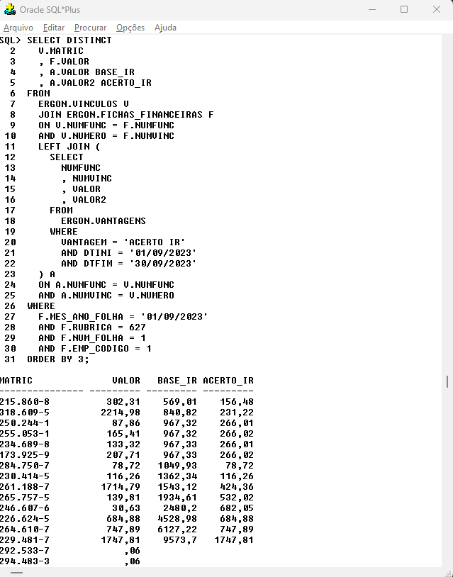
```
]

---
### SUBCONSULTAS
**Exemplo 5:** Subconsultas correlacionadas.
.pull-left[
.small-code[
```{sql eval = F}
SELECT 
  V.MATRIC , F.NUM_FOLHA, F.VALOR 
FROM 
  ERGON.VINCULOS V
  JOIN ERGON.FICHAS_FINANCEIRAS F
  ON V.NUMFUNC = F.NUMFUNC
  AND V.NUMERO = F.NUMVINC
WHERE
  V.EMP_CODIGO = 1
  AND F.MES_ANO_FOLHA = '01/09/2023'
  AND F.RUBRICA = 996
  AND F.VALOR = (
    SELECT MAX(F2.VALOR) MAXIMO #<<
    FROM #<<
      ERGON.VINCULOS V2 #<<
      JOIN ERGON.FICHAS_FINANCEIRAS F2 #<<
      ON V2.NUMFUNC = F2.NUMFUNC #<<
      AND V2.NUMERO = F2.NUMVINC #<<
    WHERE #<<
      V2.EMP_CODIGO = 1 #<<
      AND F2.MES_ANO_FOLHA = '01/09/2023' #<<
      AND F2.RUBRICA = 996 #<<
      AND F2.NUM_FOLHA = F.NUM_FOLHA #<<
      ) 
ORDER BY 2;
```
]
]
.pull-right[
Todos os exemplos apresentados até agora envolveram o uso de **subconsultas autônomas**. Ou seja, subconsultas que executariam de forma bem-sucedida caso fossem separadas da consulta pai. De maneira oposta, as **subconsultas correlacionadas** incluem referências para elementos da consulta pai e, por isso, não podem ser executadas de forma independente. Desta forma, a subconsulta
correlacionada é sempre reexecutada para cada linha gerada pela consulta pai (se a consulta pai retornar **n** linhas, a subconsulta será executada **n** vezes, uma para cada linha).
</br></br>
No *Exemplo 5*, a coluna <strong style="color:red;">*F.NUM_FOLHA*</strong> é usada na subconsulta e cada registro da consulta pai é comparado com o resultado da subconsulta.   
]
---
### SUBCONSULTAS
**Exemplo 5:** Subconsultas correlacionadas.
.pull-left[
.small-code[
```{sql eval = F}
SELECT 
  V.MATRIC , F.NUM_FOLHA, F.VALOR 
FROM 
  ERGON.VINCULOS V
  JOIN ERGON.FICHAS_FINANCEIRAS F
  ON V.NUMFUNC = F.NUMFUNC
  AND V.NUMERO = F.NUMVINC
WHERE
  V.EMP_CODIGO = 1
  AND F.MES_ANO_FOLHA = '01/09/2023'
  AND F.RUBRICA = 996
  AND F.VALOR = (
    SELECT MAX(F2.VALOR) MAXIMO #<<
    FROM #<<
      ERGON.VINCULOS V2 #<<
      JOIN ERGON.FICHAS_FINANCEIRAS F2 #<<
      ON V2.NUMFUNC = F2.NUMFUNC #<<
      AND V2.NUMERO = F2.NUMVINC #<<
    WHERE #<<
      V2.EMP_CODIGO = 1 #<<
      AND F2.MES_ANO_FOLHA = '01/09/2023' #<<
      AND F2.RUBRICA = 996 #<<
      AND F2.NUM_FOLHA = F.NUM_FOLHA #<<
      ) 
ORDER BY 2;
```
]
]
.pull-right[
```{r echo=FALSE, out.width="70%", fig.align='center', dpi=600}
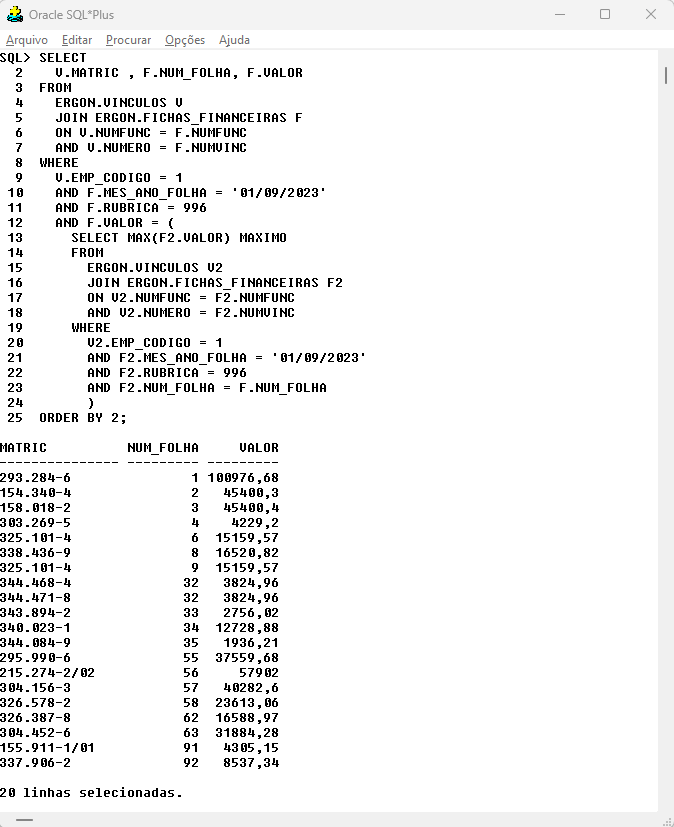
```
]
---
### EXERCÍCIOS

1. Crie uma consulta para recuperar matrículas dos servidores para quais o valor da rubrica 904 no mês de setembro seja menor do que a mediana para mesmo mês. Use as tabelas  <strong style="color:red;">ERGON.CONS</strong>  e  <strong style="color:red;">ERGON.VINCULOS</strong>. Obs.: A função utilizada para calcular a mediana é a **MEDIAN**.

2. Crie uma consulta para recuperar as matrículas dos servidores ativos lotados no setor 1 e os valores do atributo 'PLANO META VARIAVEL' cuja data início (**DTINI**) é igual a 01/10/2023. As matrículas dos servidores que não tem o atributo cadastrado também devem aparecer no resultado final.

3. Crie uma consulta para recuperar os provimentos mais recentes dos servidores lotados no setor 1. Não use a coluna **DTFIM** na cláusula **WHERE**.

4. Crie uma consulta para recuperar as matrículas dos servidores que tem o atributo 'PLANO META FIXA' cuja data início (**DTINI**) é igual a 01/10/2023 e não tem o atributo 'PLANO META VARIAVEL' com a mesma data início.

---
### EXERCÍCIOS
<ol start="5">
<li> Modifique o <em>Exemplo 5</em> de operações de conjunto para gerar a soma dos registros usando <strong>GROUP BY</strong>.
</ol>

.smaller-code[
```{sql eval = F}
SELECT 
  RUBRICA
  , SUM(VALOR) VALOR_MES_ATUAL
  , 0 VALOR_MES_ANTERIOR
FROM 
  ERGON.FICHAS_FINANCEIRAS
WHERE 
  MES_ANO_FOLHA = '01/10/2023'
  AND RUBRICA = 1
  AND EMP_CODIGO = 1
GROUP BY RUBRICA
UNION
SELECT 
  RUBRICA
  , 0 VALOR_MES_ATUAL
  , SUM(VALOR) VALOR_MES_ANTERIOR
FROM 
  ERGON.FICHAS_FINANCEIRAS
WHERE 
  MES_ANO_FOLHA = '01/09/2023'
  AND RUBRICA = 1
  AND EMP_CODIGO = 1
GROUP BY RUBRICA;
```
]
---
### SOLUÇÕES
1. Crie uma consulta para recuperar matrículas dos servidores para quais o valor da rubrica 904 no mês de setembro seja menor do que a mediana para mesmo mês. Use as tabelas  <strong style="color:red;">ERGON.CONS</strong>  e  <strong style="color:red;">ERGON.VINCULOS</strong>. Obs.: A função utilizada para calcular a mediana é a **MEDIAN**.

.small-code[
```{sql eval = F}
SELECT DISTINCT
  V.MATRIC
 , C.VALOR 
FROM
  ERGON.VINCULOS V
  JOIN ERGON.CONS C
  ON V.NUMFUNC = C.NUMFUNC
  AND V.NUMERO = C.NUMVINC
WHERE
  C.DTINI = '01/09/2023'
  AND C.RUBRICA = 904
  AND C.VALOR < (
	  SELECT 
    	MEDIAN(VALOR)
	  FROM 
    	ERGON.CONS
	  WHERE 
    	DTINI = '01/09/2023'
    	AND RUBRICA = 904);
```
]
---
### SOLUÇÕES
<ol start="2">
<li> Crie uma consulta para recuperar as matrículas dos servidores ativos lotados no setor 1 e os valores do atributo 'PLANO META VARIAVEL' cuja data início (<strong>DTINI</strong>) é igual a 01/10/2023. As matrículas dos servidores que não tem o atributo cadastrado também devem aparecer no resultado final.
</ol>

.small-code[
```{sql eval = F}
SELECT
  V.MATRIC, A.VALOR
FROM 
  ERGON.VINCULOS V
  JOIN ERGON.PROVIMENTOS_EV P
  ON V.NUMFUNC = P.NUMFUNC
  AND V.NUMERO = P.NUMVINC
  LEFT JOIN (
	SELECT NUMFUNC, NUMVINC, VALOR
	FROM ERGON.VANTAGENS 
	WHERE VANTAGEM = 'PLANO META VARIAVEL'
	AND DTINI = '01/10/2023') A
  ON V.NUMFUNC = A.NUMFUNC
  AND V.NUMERO = A.NUMVINC
WHERE
  P.SETOR = '1'
  AND P.DTFIM IS NULL
  AND V.DTVAC IS NULL;
```
]
---
### SOLUÇÕES
<ol start="3">
<li> Crie uma consulta para recuperar os provimentos mais recentes dos servidores lotados no setor 1. Não use a coluna <strong>DTFIM</strong> na cláusula <strong>WHERE</strong>.
</ol>

.small-code[
```{sql eval = F}
SELECT
  V.MATRIC, A.VALOR
FROM 
  ERGON.VINCULOS V
  JOIN ERGON.PROVIMENTOS_EV P
  ON V.NUMFUNC = P.NUMFUNC
  AND V.NUMERO = P.NUMVINC
WHERE
  P.SETOR = '1'
  P.DTINI = (
    SELECT   #<<
      MAX(P2.DTINI) #<<
    FROM #<<
      ERGON.PROVIMENTOS_EV P2 #<<
    WHERE #<<
      P.NUMFUNC = P2.NUMFUNC #<<
      AND P.NUMVINC = P2.NUMVINC #<<
);
```
]
---
### SOLUÇÕES
<ol start="4">
<li> Crie uma consulta para recuperar as matrículas dos servidores que tem o atributo 'PLANO META FIXA' cuja data início (<strong>DTINI</strong>) é igual a 01/10/2023 e não tem o atributo 'PLANO META VARIAVEL' com a mesma data início.
</ol>
```{sql eval = F}
SELECT
  V.MATRIC
FROM 
  ERGON.VINCULOS V
  JOIN ERGON.VANTAGENS VA
  ON V.NUMFUNC = VA.NUMFUNC
  AND V.NUMERO = VA.NUMVINC
WHERE
  VA.VANTAGEM = 'PLANO META FIXA'
  AND VA.DTINI = '01/10/2023'
MINUS
SELECT
  V.MATRIC
FROM 
  ERGON.VINCULOS V
  JOIN ERGON.VANTAGENS VA
  ON V.NUMFUNC = VA.NUMFUNC
  AND V.NUMERO = VA.NUMVINC
WHERE
  VA.VANTAGEM = 'PLANO META VARIAVEL'
  AND VA.DTINI = '01/10/2023';
```
---
### SOLUÇÕES

<ol start="5">
<li> Modifique o <em>Exemplo 5</em> de operações de conjunto para gerar a soma dos registros usando <strong>GROUP BY</strong>.
</ol>

.smaller-code[
```{sql eval = F}
SELECT
 RUBRICA
 , SUM(VALOR_MES_ATUAL)    VALOR_MES_ATUAL 
 , SUM(VALOR_MES_ANTERIOR) VALOR_MES_ANTERIOR
FROM (
  SELECT 
    RUBRICA
    , SUM(VALOR) VALOR_MES_ATUAL
    , 0 VALOR_MES_ANTERIOR
  FROM 
    ERGON.FICHAS_FINANCEIRAS
  WHERE 
    MES_ANO_FOLHA = '01/10/2023'
    AND RUBRICA = 1
    AND EMP_CODIGO = 1
  GROUP BY RUBRICA
  UNION
  SELECT 
    RUBRICA
    , 0 VALOR_MES_ATUAL
    , SUM(VALOR) VALOR_MES_ANTERIOR
  FROM 
    ERGON.FICHAS_FINANCEIRAS
  WHERE 
    MES_ANO_FOLHA = '01/09/2023'
    AND RUBRICA = 1
    AND EMP_CODIGO = 1
  GROUP BY RUBRICA
  ) A
GROUP BY RUBRICA
;
```
]
---
class: center, middle
# COMANDOS DO SQL*PLUS

---
### COMANDOS DO SQL*PLUS

O **SQL\*Plus** é uma ferramenta poderosa para interagir com bancos de dados Oracle e oferece uma variedade de comandos exclusivos que facilitam o trabalho com consultas SQL e relatórios. A seguir, comentaremos alguns dos principais comandos do **SQL\*Plus**.

* **@ (sinal de arroba)**: Executa declarações do SQL\*Plus no script especificado. O script pode ser chamado do sistema de arquivos local ou de um servidor web. Ex.: O comando *'@C:/TEMP/TESTE.sql'* executa o arquivo SQL *'TESTE.sql'* localizado na pasta *'C:/TEMP/'*.

* **@@ (sinal de arroba duplo)**: Este comando é semelhante ao comando **@ (sinal de arroba)**. É útil para a execução de scripts aninhados, pois procura o script especificado no mesmo caminho (pasta) do script que o chama.

* **/ (barra)**: Executa o comando SQL ou bloco PL/SQL. Pode ser usado no final de uma consulta para executar o bloco, se usado no lugar do **';'**, ou reexecutar o bloco.

* **EXIT**: Encerra o SQL\*Plus.

* **SPOOL**: Armazena os resultados de uma consulta em um arquivo do sistema operacional e, opcionalmente, envia o arquivo para uma impressora. Ex.: O comando *'SPOOL C:/TEMP/Arquivo1.TXT'* armazena o resultado no arquivo chamado *'Arquivo1.TXT'*. O comando deve contar antes dos códigos da consulta e o comando *'SPOOL OFF;'* deve constar no final do arquivo *'.sql'*. É possível salvar arquivos com as extensões *'.txt'*, *'.csv'*, *'.html'*, *'.sql'* e *'.log'*.

---
### COMANDOS DO SQL*PLUS

* **DEFINE**: Especifica um usuário ou variável predefinida e atribui um valor CHAR a ela, ou lista o valor e o tipo de variável única ou de todas as variáveis. Ex.: DEFINE MES = 01/02/2020. É possível usar o valor definido posteriormente na consulta.


* **SET**: Define uma variável de sistema para alterar as configurações do ambiente do SQL*Plus para sua sessão atual, por exemplo, para: personalizar a formatação HTML, habilitar ou desabilitar a impressão de cabeçalhos de coluna, definir o número de linhas por página ou definir a largura de exibição dos dados. Ex.: SET TIME ON;

```{r tab0, echo = F}
data.frame(
  Comando = c("SET AUTOTRACE", "SET FEEDBACK", "SET LINESIZE", "SET PAGESIZE", "SET SERVEROUTPUT", "SET SQLBLANKLINES", "SET TIMING", "SET HEADING", "SET ECHO", "SET TERMOUT", "SET VERIFY", "SET SERVEROUTPUT"),
  Descrição = c(
    "Controla a exibição de informações de otimização de consultas.",
    "Controla a exibição de mensagens de feedback após a execução de comandos.",
    "Define a largura máxima das linhas de saída em caracteres.",
    "Define o número de linhas por página ao exibir resultados de consulta.",
    "Controla a exibição de mensagens do servidor PL/SQL.",
    "Controla a exibição de linhas em branco em resultados de consulta.",
    "Exibe o tempo gasto na execução de comandos SQL.",
    "Controla a exibição de cabeçalhos de coluna.",
    "Ativa ou desativa a exibição dos comandos SQL executados.",
    "Ativa ou desativa a exibição de saída de script.",
    "Ativa ou desativa a verificação de sintaxe do SQL.",
    "Controla a exibição de saída do servidor PL/SQL."
  )
) |> 
  gt::gt() |> 
  gt::tab_style(style = gt::cell_text(weight = "bold",size = 18), 
                locations = gt::cells_column_labels()) |> 
  gt::tab_options(table.font.size = 15,
                  container.width = 900,
                  container.height = 300) |> 
  gt::tab_style(style = gt::cell_text(weight = "bold",size = 22), 
                locations = gt::cells_body()) |> 
  gt::opt_stylize(style = 5, color = "blue", add_row_striping = F)

```

---
### Referências

* Material do Curso "Bases de Dados" - Prof. Eduardo Corrêa Gonçalves (ENCE/IBGE);
* Livro Introdução à linguagem SQL - Thomas Nield (O'REILLY);
* Documentação [SQL Language Reference](https://docs.oracle.com/en/database/oracle/oracle-database/19/sqlrf/index.html#Oracle%C2%AE-Database) (ORACLE) 
* Lista de [comandos SET](https://docs.oracle.com/en/database/oracle/oracle-database/19/sqpug/SET-system-variable-summary.html#GUID-A6A5ADFF-4119-4BA4-A13E-BC8D29166FAE)